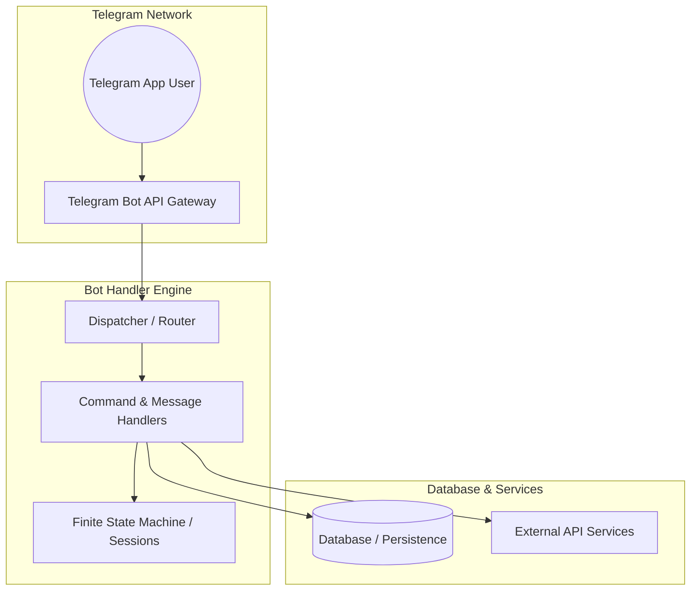

# Architecture Report: Probox_TelegramBot

## 1. Executive Summary
This architecture report provides an in-depth code-level analysis of the **Probox_TelegramBot** repository. The codebase spans approximately **52,560** lines of code across **264** scanned files with a total size of **19947.17 KB**.

It was identified as a **Telegram Bot (Node.js)** project with **TypeScript** as the primary programming language.

## 2. Detected Project Type
* **Primary Project Type:** Telegram Bot (Node.js)
* **Primary Language:** TypeScript
* **Key Frameworks:** grammy
* **Analysis Depth:** deep

## 3. Technology Stack
| Category | Technology / Library | Description |
| --- | --- | --- |
| Language | TypeScript | Main programming language |
| Framework | fastify (^4.29.1) | Core library |
| Bot Framework | grammy (^1.39.3) | Core library |
| Database | knex (^3.1.0) | Core library |
| Database | pg (^8.17.2) | Core library |

## 4. Repository Structure
```text
Probox_TelegramBot/
├── .agents/
│   └── rules/
│       └── working-style.md
├── .codex/
│   └── environments/
│       └── environment.toml
├── .dockerignore
├── .env
├── .env.example
├── .gitignore
├── .prettierrc
├── .vscode/
│   └── tasks.json
├── Dockerfile
├── Docs/
│   ├── ChatGPTAPIFunctionUseGuide.md
│   ├── ChatGPTSystemInstructionsGuide.md
│   ├── DeeplinkingDocs.md
│   ├── FAQ_Embeddings_Technical_Document.md
│   ├── GeminiDocs.md
│   ├── Gemini_3_1_Docs.md
│   ├── SapGetItemsUseCase.md
│   ├── SapPercentageTable.md
│   └── Support_Agent_Gemini_Review_2026-04-20.md
├── README.md
├── docker-compose.yml
├── entrypoint.sh
├── eslint.config.mjs
├── knexfile.ts
├── logs/
├── output/
│   ├── playwright/
│   └── spreadsheet/
│       └── payment_verification_report_2026-04-10.xlsx
├── package-lock.json
├── package.json
├── src/
│   ├── api/
│   │   ├── controllers/
│   │   │   ├── bot.controller.ts
│   │   │   ├── coupons.controller.spec.ts
│   │   │   ├── coupons.controller.ts
│   │   │   ├── purchase-pdf-delivery.controller.spec.ts
│   │   │   └── purchase-pdf-delivery.controller.ts
│   │   ├── errors/
│   │   │   ├── api-error.ts
│   │   │   └── error-handler.ts
│   │   ├── mappers/
│   │   ├── middlewares/
│   │   │   └── api-key.middleware.ts
│   │   ├── routes/
│   │   │   ├── bot.routes.ts
│   │   │   ├── coupons.routes.ts
│   │   │   └── purchase-pdf-delivery.routes.ts
│   │   └── server.ts
│   ├── app/
│   │   ├── bootstrap.ts
│   │   ├── start-api.ts
│   │   ├── start-bot.spec.ts
│   │   └── start-bot.ts
│   ├── bot.ts
│   ├── config/
│   │   ├── deep-links.ts
│   │   └── index.ts
│   ├── conversations/
│   │   ├── admin-campaign.conversation.ts
│   │   ├── admin-faq.conversation.ts
│   │   ├── admin-reply.conversation.ts
│   │   ├── admin-template.conversation.ts
│   │   ├── admin.conversation.ts
│   │   ├── application.conversation.ts
│   │   ├── branches.conversation.ts
│   │   ├── example.conversation.ts
│   │   ├── passport.conversation.ts
│   │   ├── passport_parts/
│   │   │   ├── confirmation.part.ts
│   │   │   ├── manual.part.ts
│   │   │   ├── photo.part.ts
│   │   │   └── utils.part.ts
│   │   ├── registration.conversation.ts
│   │   ├── settings.conversation.ts
│   │   └── support.conversation.ts
│   ├── cron/
│   │   ├── payment-reminder.cron.ts
│   │   ├── sap-sync.cron.ts
│   │   └── scheduled-broadcast.cron.ts
│   ├── data/
│   │   └── contracts.mock.ts
│   ├── database/
│   │   ├── database.ts
│   │   ├── migrations/
│   │   │   ├── 20260121044103_create_users_table.ts
│   │   │   ├── 20260129074319_create_support_schema.ts
│   │   │   ├── 20260208130000_add_is_logged_out.ts
│   │   │   ├── 20260224072858_add_jshshir_and_passport_series_to_users.ts
│   │   │   ├── 20260316080358_create_branches.ts
│   │   │   ├── 20260327095120_create_promotions.ts
│   │   │   ├── 20260327095130_create_coupons.ts
│   │   │   ├── 20260327095135_create_coupon_user_mappings.ts
│   │   │   ├── 20260327103500_create_message_templates.ts
│   │   │   ├── 20260328110100_create_promotion_prizes.ts
│   │   │   ├── 20260328110200_create_payment_reminder_logs.ts
│   │   │   ├── 20260328110300_create_payment_installment_state.ts
│   │   │   ├── 20260328110400_create_message_dispatch_logs.ts
│   │   │   ├── 20260328113000_repair_coupons_schema.ts
│   │   │   ├── 20260328113100_repair_message_templates_schema.ts
│   │   │   ├── 20260328120000_repair_promotions_schema.ts
│   │   │   ├── 20260329113000_make_promotion_slug_unique_only_for_active_rows.ts
│   │   │   ├── 20260331180000_add_coupon_registration_tracking.ts
│   │   │   ├── 20260402090000_create_faqs.ts
│   │   │   ├── 20260407062934_link_coupons_to_sap_installments.ts
│   │   │   ├── 20260409090000_make_coupon_registration_event_user_nullable.ts
│   │   │   ├── 20260410093000_expand_coupon_code_length.ts
│   │   │   ├── 20260410184500_expand_payment_reminder_type_enum.ts
│   │   │   ├── 20260412160000_add_agent_support_handoff.ts
│   │   │   ├── 20260413123228_add_address_to_users.ts
│   │   │   ├── 20260417143000_add_promotion_prize_images.ts
│   │   │   ├── 20260430120000_create_scheduled_broadcasts.ts
│   │   │   └── 20260504100000_add_index_to_users_phone_number.ts
│   │   ├── schema-validation.ts
│   │   └── schema-validation.ts.orig
│   ├── handlers/
│   │   ├── admin-reply.handler.ts
│   │   ├── admin.handler.ts
│   │   ├── application.handler.ts
│   │   ├── branches.handler.ts
│   │   ├── campaign.handler.spec.ts
│   │   ├── campaign.handler.ts
│   │   ├── contracts.handler.ts
│   │   ├── help.handler.ts
│   │   ├── logout.handler.ts
│   │   ├── payments.handler.ts
│   │   ├── settings.handler.ts
│   │   ├── start.handler.ts
│   │   └── support.handler.ts
│   ├── i18n.ts
│   ├── interfaces/
│   │   ├── business-partner.interface.ts
│   │   ├── item.interface.ts
│   │   ├── payment.interface.ts
│   │   └── purchase.interface.ts
│   ├── keyboards/
│   │   ├── admin.keyboards.ts
│   │   ├── branch.keyboards.spec.ts
│   │   ├── branch.keyboards.ts
│   │   ├── campaign.keyboards.ts
│   │   ├── faq.keyboards.ts
│   │   ├── index.ts
│   │   └── template.keyboards.ts
│   ├── locales/
│   │   ├── ru.ftl
│   │   └── uz.ftl
│   ├── middlewares/
│   │   ├── logger.middleware.ts
│   │   └── session.middleware.ts
│   ├── redis/
│   │   └── redis.service.ts
│   ├── sap/
│   │   ├── hana.service.ts
│   │   ├── queries/
│   │   │   ├── get-bp-purchases-batch.sql
│   │   │   ├── get-bp-purchases.sql
│   │   │   ├── get-business-partner-by-jshshir.sql
│   │   │   ├── get-business-partner.sql
│   │   │   ├── get-business-partners-batch.sql
│   │   │   ├── get-currency-rate.sql
│   │   │   ├── get-payment-reminder-installments.sql
│   │   │   └── test-get-inst-payment-dates.sql
│   │   ├── sap-hana.get-items.spec.ts
│   │   ├── sap-hana.service.spec.ts
│   │   ├── sap-hana.service.ts
│   │   └── test-sap.ts
│   ├── scripts/
│   │   ├── check-gemini-key.ts
│   │   ├── check-items.ts
│   │   ├── debug-contracts.ts
│   │   ├── get-business-partner.ts
│   │   ├── repair-payment-on-time-coupons.ts
│   │   ├── run-payment-reminder.ts
│   │   ├── test-payment-dates.ts
│   │   ├── test-payment-reminder.ts
│   │   ├── test-purchase-pdf.ts
│   │   └── test-sync.ts
│   ├── server.ts
│   ├── services/
│   │   ├── admin.service.ts
│   │   ├── bot-notification.service.spec.ts
│   │   ├── bot-notification.service.ts
│   │   ├── branch.service.ts
│   │   ├── broadcast.service.ts
│   │   ├── contract.service.spec.ts
│   │   ├── contract.service.ts
│   │   ├── coupon/
│   │   │   ├── coupon-export.service.ts
│   │   │   ├── coupon-registration-event.service.ts
│   │   │   ├── coupon-registration.service.spec.ts
│   │   │   ├── coupon-registration.service.ts
│   │   │   ├── coupon.service.ts
│   │   │   ├── payment-on-time-coupon-repair.service.spec.ts
│   │   │   ├── payment-on-time-coupon-repair.service.ts
│   │   │   ├── promotion.service.ts
│   │   │   └── referral.service.ts
│   │   ├── error-notification.service.spec.ts
│   │   ├── error-notification.service.ts
│   │   ├── export.service.ts
│   │   ├── faq/
│   │   │   ├── faq-ai.service.spec.ts
│   │   │   ├── faq-ai.service.ts
│   │   │   ├── faq-embedding.service.ts
│   │   │   ├── faq-routing.service.spec.ts
│   │   │   ├── faq-routing.service.ts
│   │   │   ├── faq.service.spec.ts
│   │   │   └── faq.service.ts
│   │   ├── gemini.service.spec.ts
│   │   ├── gemini.service.ts
│   │   ├── lock.service.ts
│   │   ├── message-template.service.ts
│   │   ├── minio.service.ts
│   │   ├── ocr.service.spec.ts
│   │   ├── ocr.service.ts
│   │   ├── otp.service.ts
│   │   ├── payment/
│   │   │   ├── payment-reminder.service.spec.ts
│   │   │   ├── payment-reminder.service.ts
│   │   │   ├── payment.service.spec.ts
│   │   │   └── payment.service.ts
│   │   ├── purchase-pdf-delivery.service.spec.ts
│   │   ├── purchase-pdf-delivery.service.ts
│   │   ├── purchase-pdf.service.ts
│   │   ├── support/
│   │   │   ├── support-agent.service.spec.ts
│   │   │   ├── support-agent.service.ts
│   │   │   ├── support-currency.service.spec.ts
│   │   │   ├── support-currency.service.ts
│   │   │   ├── support-dispatcher.service.ts
│   │   │   ├── support-installment.service.spec.ts
│   │   │   ├── support-installment.service.ts
│   │   │   ├── support-item-availability.service.spec.ts
│   │   │   ├── support-item-availability.service.ts
│   │   │   └── support.service.ts
│   │   ├── user.service.spec.ts
│   │   └── user.service.ts
│   ├── types/
│   │   ├── context.ts
│   │   ├── faq.types.ts
│   │   └── support.types.ts
│   ├── uploads/
│   │   ├── back.JPG
│   │   ├── front.JPG
│   │   └── test.mp4
│   └── utils/
│       ├── account-switch.util.ts
│       ├── application/
│       │   ├── application-payload.util.spec.ts
│       │   └── application-payload.util.ts
│       ├── branch.util.spec.ts
│       ├── branch.util.ts
│       ├── currency-conversion.util.spec.ts
│       ├── currency-conversion.util.ts
│       ├── faq/
│       │   ├── faq-match.util.spec.ts
│       │   ├── faq-match.util.ts
│       │   ├── faq-routing-score.util.spec.ts
│       │   ├── faq-routing-score.util.ts
│       │   ├── inventory-intent.util.spec.ts
│       │   └── inventory-intent.util.ts
│       ├── formatting/
│       │   ├── formatter.util.spec.ts
│       │   ├── formatter.util.ts
│       │   ├── items-formatter.util.spec.ts
│       │   ├── items-formatter.util.ts
│       │   ├── promotion-text.util.spec.ts
│       │   ├── promotion-text.util.ts
│       │   ├── ui-text-resolver.spec.ts
│       │   ├── ui-text-resolver.ts
│       │   └── verify-formatter.ts
│       ├── gemini-error.util.spec.ts
│       ├── gemini-error.util.ts
│       ├── locale.ts
│       ├── logger.ts
│       ├── passport/
│       │   ├── face-detection.util.ts
│       │   ├── passport-image.util.ts
│       │   ├── passport-scan.util.spec.ts
│       │   └── passport-scan.util.ts
│       ├── registration.check.ts
│       ├── sap-business-partner.util.spec.ts
│       ├── sap-business-partner.util.ts
│       ├── sql-loader.utils.ts
│       ├── support/
│       │   ├── support-application-router.util.spec.ts
│       │   ├── support-application-router.util.ts
│       │   ├── support-intent.util.spec.ts
│       │   ├── support-intent.util.ts
│       │   ├── support-transcript-html.util.spec.ts
│       │   ├── support-transcript-html.util.ts
│       │   ├── support.util.spec.ts
│       │   └── support.util.ts
│       ├── telegram/
│       │   ├── admin-group-chat.util.ts
│       │   ├── telegram-errors.spec.ts
│       │   ├── telegram-errors.ts
│       │   ├── telegram-file.util.ts
│       │   ├── telegram-rich-text.util.spec.ts
│       │   └── telegram-rich-text.util.ts
│       ├── time/
│       │   ├── tashkent-time.util.spec.ts
│       │   └── tashkent-time.util.ts
│       ├── uz-phone.util.spec.ts
│       └── uz-phone.util.ts
├── tmp/
│   ├── coupons_2026-04-26.xlsx
│   └── users_2026-04-26.xlsx
└── tsconfig.json
```

## 5. Entry Points
* **`src/server.ts`** - Primary startup file.

## 6. Main Modules and Responsibilities
Below is a summary of the main modules scanned and their deduced roles:
### `src/interfaces/business-partner.interface.ts`
* **Deduced Role:** General Script / Helper, TypeScript Typings Definition
* **Classes/Structures:** `Interface: IBusinessPartner`
### `src/database/database.ts`
* **Deduced Role:** General Script / Helper
* **Dependencies Imported:** `knex`
### `src/handlers/branches.handler.ts`
* **Deduced Role:** General Script / Helper
### `src/api/routes/bot.routes.ts`
* **Deduced Role:** API Routing Table, Web Endpoint Provider
* **Dependencies Imported:** `fastify`
### `src/i18n.ts`
* **Deduced Role:** General Script / Helper
* **Dependencies Imported:** `@grammyjs/i18n`, `path`
### `src/api/errors/api-error.ts`
* **Deduced Role:** General Script / Helper
* **Classes/Structures:** `ApiError`
### `src/api/routes/purchase-pdf-delivery.routes.ts`
* **Deduced Role:** API Routing Table, Web Endpoint Provider
* **Dependencies Imported:** `fastify`
### `src/conversations/example.conversation.ts`
* **Deduced Role:** General Script / Helper
* **Key Functions:** `exampleConversation`
### `src/handlers/application.handler.ts`
* **Deduced Role:** General Script / Helper
### `src/database/migrations/20260413123228_add_address_to_users.ts`
* **Deduced Role:** General Script / Helper
* **Key Functions:** `down`, `up`
* **Dependencies Imported:** `knex`
### `src/database/migrations/20260208130000_add_is_logged_out.ts`
* **Deduced Role:** General Script / Helper
* **Key Functions:** `down`, `up`
* **Dependencies Imported:** `knex`
### `src/database/migrations/20260504100000_add_index_to_users_phone_number.ts`
* **Deduced Role:** General Script / Helper
* **Key Functions:** `down`, `up`
* **Dependencies Imported:** `knex`
### `src/database/migrations/20260224072858_add_jshshir_and_passport_series_to_users.ts`
* **Deduced Role:** General Script / Helper
* **Key Functions:** `down`, `up`
* **Dependencies Imported:** `knex`
### `src/scripts/test-sync.ts`
* **Deduced Role:** General Script / Helper
* **Key Functions:** `runTest`
* **Dependencies Imported:** `dotenv`
### `src/utils/sap-business-partner.util.ts`
* **Deduced Role:** General Script / Helper
### `src/utils/sql-loader.utils.ts`
* **Deduced Role:** General Script / Helper
* **Key Functions:** `loadSQL`
* **Dependencies Imported:** `fs`, `path`
### `src/server.ts`
* **Deduced Role:** General Script / Helper
* **Key Functions:** `main`
### `src/middlewares/logger.middleware.ts`
* **Deduced Role:** HTTP Middleware Filter
* **Dependencies Imported:** `grammy`
### `src/utils/locale.ts`
* **Deduced Role:** General Script / Helper
* **Key Functions:** `getLocaleFromConversation`
### `src/database/migrations/20260410093000_expand_coupon_code_length.ts`
* **Deduced Role:** General Script / Helper
* **Key Functions:** `down`, `up`
* **Dependencies Imported:** `knex`
### `src/app/start-api.ts`
* **Deduced Role:** General Script / Helper
* **Dependencies Imported:** `fastify`
### `src/interfaces/purchase.interface.ts`
* **Deduced Role:** General Script / Helper, TypeScript Typings Definition
* **Classes/Structures:** `Interface: IPurchaseInstallment`
### `src/utils/account-switch.util.ts`
* **Deduced Role:** General Script / Helper
* **Key Functions:** `clearAccountSwitchArtifacts`
### `src/database/migrations/20260327095135_create_coupon_user_mappings.ts`
* **Deduced Role:** General Script / Helper
* **Key Functions:** `down`, `up`
* **Dependencies Imported:** `knex`
### `src/database/migrations/20260329113000_make_promotion_slug_unique_only_for_active_rows.ts`
* **Deduced Role:** General Script / Helper
* **Key Functions:** `down`, `up`
* **Dependencies Imported:** `knex`
### `src/scripts/run-payment-reminder.ts`
* **Deduced Role:** General Script / Helper
* **Key Functions:** `main`
### `src/database/migrations/20260121044103_create_users_table.ts`
* **Deduced Role:** General Script / Helper
* **Key Functions:** `down`, `up`
* **Dependencies Imported:** `knex`
### `src/database/migrations/20260328110100_create_promotion_prizes.ts`
* **Deduced Role:** General Script / Helper
* **Key Functions:** `down`, `up`
* **Dependencies Imported:** `knex`
### `src/scripts/test-payment-reminder.ts`
* **Deduced Role:** General Script / Helper
* **Key Functions:** `main`
### `src/database/migrations/20260316080358_create_branches.ts`
* **Deduced Role:** General Script / Helper
* **Key Functions:** `down`, `up`
* **Dependencies Imported:** `knex`

*... and 192 other modules.*

## 7. Dependency Analysis
The parsed dependencies are categorized as follows:

### Bot Framework
| Package | Version | Scope |
| --- | --- | --- |
| `grammy` | ^1.39.3 | prod |

### Database
| Package | Version | Scope |
| --- | --- | --- |
| `knex` | ^3.1.0 | prod |
| `pg` | ^8.17.2 | prod |

### Framework
| Package | Version | Scope |
| --- | --- | --- |
| `fastify` | ^4.29.1 | prod |

### Other
| Package | Version | Scope |
| --- | --- | --- |
| `@fastify/cors` | ^9.0.1 | prod |
| `@grammyjs/conversations` | ^2.1.1 | prod |
| `@grammyjs/i18n` | ^1.1.2 | prod |
| `@grammyjs/storage-redis` | ^2.5.1 | prod |
| `@gutenye/ocr-node` | ^1.4.8 | prod |
| `@sap/hana-client` | ^2.27.19 | prod |
| `@tensorflow/tfjs` | ^4.22.0 | prod |
| `@tensorflow/tfjs-backend-wasm` | ^4.22.0 | prod |
| `@vladmandic/face-api` | ^1.7.15 | prod |
| `axios` | ^1.13.2 | prod |
| `dotenv` | ^17.2.3 | prod |
| `exceljs` | ^4.4.0 | prod |
| `form-data` | ^4.0.5 | prod |
| `ioredis` | ^5.9.2 | prod |
| `jsqr` | ^1.4.0 | prod |
| `minio` | ^8.0.6 | prod |
| `node-cron` | ^4.2.1 | prod |
| `sharp` | ^0.34.5 | prod |
| `@eslint/js` | ^9.39.2 | dev |
| `@types/form-data` | ^2.2.1 | dev |
| `@types/node` | ^25.0.9 | dev |
| `@types/node-cron` | ^3.0.11 | dev |
| `@typescript-eslint/eslint-plugin` | ^8.53.0 | dev |
| `@typescript-eslint/parser` | ^8.53.0 | dev |
| `copyfiles` | ^2.4.1 | dev |
| `eslint` | ^9.39.2 | dev |
| `eslint-config-prettier` | ^10.1.8 | dev |
| `globals` | ^17.6.0 | dev |
| `nodemon` | ^3.1.11 | dev |
| `prettier` | ^3.8.0 | dev |
| `rimraf` | ^6.1.3 | dev |
| `ts-node` | ^10.9.2 | dev |
| `typescript` | ^5.9.3 | dev |
| `typescript-eslint` | ^8.53.0 | dev |


## 8. Configuration and Environment Variables
The following environment variable references were detected:

| Variable Name | Source File / Details |
| --- | --- |
| `ADMIN_GROUP_ID` | Configured or read in project |
| `API_CORS_ORIGIN` | Configured or read in project |
| `API_ENABLED` | Configured or read in project |
| `API_HOST` | Configured or read in project |
| `API_KEY` | Configured or read in project |
| `API_PORT` | Configured or read in project |
| `API_PREFIX` | Configured or read in project |
| `BOT_DOMAIN` | Configured or read in project |
| `BOT_ENABLED` | Configured or read in project |
| `BOT_TOKEN` | Configured or read in project |
| `BOT_USERNAME` | Configured or read in project |
| `BROADCAST_BATCH_SIZE` | Configured or read in project |
| `BROADCAST_DELAY_MS` | Configured or read in project |
| `CRM_LOGIN` | Configured or read in project |
| `CRM_PASS` | Configured or read in project |
| `CRM_URL` | Configured or read in project |
| `DB_HOST` | Configured or read in project |
| `DB_NAME` | Configured or read in project |
| `DB_PASS` | Configured or read in project |
| `DB_PORT` | Configured or read in project |
| `DB_USER` | Configured or read in project |
| `ERROR_NOTIFICATION_CHAT_ID` | Configured or read in project |
| `EXPORT_RATE_LIMIT` | Configured or read in project |
| `FAQ_AUTO_REPLY_MAX_DISTANCE` | Configured or read in project |
| `FAQ_AUTO_REPLY_MIN_CONFIDENCE` | Configured or read in project |
| `FAQ_EMBEDDING_DIM` | Configured or read in project |
| `FAQ_SEMANTIC_AUTO_REPLY_ENABLED` | Configured or read in project |
| `FAQ_SIMILAR_LIMIT` | Configured or read in project |
| `GEMINI_API_KEY` | Configured or read in project |
| `GEMINI_EMBEDDING_MODEL` | Configured or read in project |
| `GEMINI_REQUEST_TIMEOUT_MS` | Configured or read in project |
| `GEMINI_SUPPORT_AGENT_MODEL` | Configured or read in project |
| `GEMINI_TEXT_MODEL` | Configured or read in project |
| `LOG_LEVEL` | Configured or read in project |
| `MINIO_ACCESS_KEY` | Configured or read in project |
| `MINIO_BUCKET` | Configured or read in project |
| `MINIO_ENDPOINT` | Configured or read in project |
| `MINIO_PORT` | Configured or read in project |
| `MINIO_SECRET_KEY` | Configured or read in project |
| `MINIO_USE_SSL` | Configured or read in project |
| `MYID_BASE_URL` | Configured or read in project |
| `MYID_CLIENT_ID` | Configured or read in project |
| `MYID_CLIENT_SECRET` | Configured or read in project |
| `NODE_ENV` | Configured or read in project |
| `OPENAI_API_KEY` | Configured or read in project |
| `PASSPORT_SCANNER_GIF_ID` | Configured or read in project |
| `PASSWORD` | Configured or read in project |
| `PAYMENT_REMINDER_CRON_SCHEDULE` | Configured or read in project |
| `PAYMENT_REMINDER_RUN_NOW` | Configured or read in project |
| `PAYMENT_REMINDER_TEST_NOW` | Configured or read in project |
| `PAYMENT_REWARD_TARGET_MONTH` | Configured or read in project |
| `PURCHASE_PDF_API_BASE_URL` | Configured or read in project |
| `PURCHASE_PDF_API_PASS` | Configured or read in project |
| `PURCHASE_PDF_API_USER` | Configured or read in project |
| `PURCHASE_PDF_TEST_DOC_ENTRY` | Configured or read in project |
| `REDIS_HOST` | Configured or read in project |
| `REDIS_PASSWORD` | Configured or read in project |
| `REDIS_PORT` | Configured or read in project |
| `SAP_API_URL` | Configured or read in project |
| `SAP_PASSWORD` | Configured or read in project |
| `SAP_REDIS_CACHE_ENABLED` | Configured or read in project |
| `SAP_REDIS_CACHE_TTL_SECONDS` | Configured or read in project |
| `SAP_REDIS_VOLATILE_CACHE_TTL_SECONDS` | Configured or read in project |
| `SAP_SCHEMA` | Configured or read in project |
| `SAP_SYNC_CRON_SCHEDULE` | Configured or read in project |
| `SAP_USER` | Configured or read in project |
| `SCHEDULED_BROADCAST_CRON_SCHEDULE` | Configured or read in project |
| `SERVER_NODE` | Configured or read in project |
| `SERVER_NODE_LOCAL` | Configured or read in project |
| `SMS_API_URL` | Configured or read in project |
| `SMS_ORIGINATOR` | Configured or read in project |
| `SMS_PASSWORD` | Configured or read in project |
| `SMS_USERNAME` | Configured or read in project |
| `SUPPORT_GROUP_ID` | Configured or read in project |
| `UID` | Configured or read in project |

## 9. Data Flow
1. Startup configuration loads environment variables and registers bot handler routes (defined in `src/server.ts`).
2. Telegram network forwards messages, queries, or command payloads to the Bot dispatch server.
3. Dispatcher resolves commands or conversation state, and matches to corresponding callback handlers.
4. Handlers interact with DB or APIs, then reply with updated text, menus, or custom keyboards.

## 10. Backend/API Architecture
This project does not appear to expose a standard HTTP/Web backend API.

## 11. Frontend Architecture
This project does not contain a standard React, Next.js, or Vite frontend client UI.

## 12. Telegram Bot Architecture
### Telegram Bot Details (Framework: grammY (Node.js))

#### Registered Bot Commands:
* `/about`
* `/admin`
* `/help`
* `/logout`
* `/start`

* **Message Handlers Count:** 11
* **Callback Query Handlers Count:** 83
* **FSM / Session Storage Active:** Yes

## 13. Database Layer
Database technology and connection interfaces: **knex (^3.1.0)**

## 14. Authentication and Authorization
No explicit third-party authentication library (JWT, Passport, etc.) was detected. The project may be public, use basic authorization headers, or handle logins externally.

## 15. External Integrations
* REST API Integration via Axios client
* Telegram Bot API network integration

## 16. Error Handling and Logging
The application utilizes standard built-in console logs (`console.log` or Python `logging`) without third-party structured log libraries.

## 17. Testing Setup
* **Test Suite Folder:** Dedicated test directory/files detected in repository.

## 18. Build and Deployment
* **Docker support:** `Dockerfile` is present.
* **Docker Compose:** `docker-compose.yml` is present.

## 19. Architecture Diagram


## 20. Risks and Weak Points
No critical entries detected under this section.

## 21. Improvement Recommendations
* Maintain modular directory boundaries and document public functions with docstrings.

## 22. Suggested Refactoring Plan
1. Configure a rigid Environment Layer: Extract all API keys and config tokens to a secure `.env` file.
2. Split helper scripts into a dedicated `utils/` or `helpers/` sub-package.
3. Integrate a Testing Suite: Write core unit tests and cover primary handlers.
4. Containerization: Add a standard Dockerfile and docker-compose.yml configuration to simplify deployments.

## 23. Final Notes
Report generated automatically on 2026 by Architecture Analyzer.
