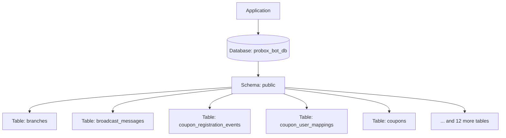
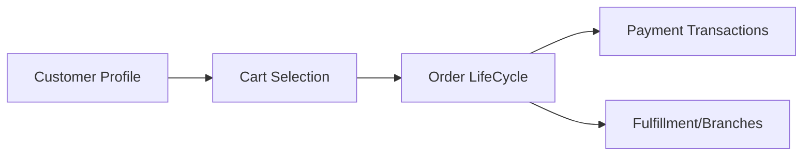

# PostgreSQL Architecture Report: probox_bot_db

## 1. Executive Summary
This document provides a comprehensive structural audit and architectural analysis of the **probox_bot_db** database on the PostgreSQL server. The analysis is **metadata-only**, focusing strictly on catalogs, schemas, tables, columns, indexes, triggers, and statistics to ensure complete security of application business records.

Based on our automated inference, this database functions as a **E-commerce System** with a confidence score of **90%**.

---

## 2. Connection Summary
- **Host**: `localhost`
- **Port**: `5432`
- **User**: `postgres`
- **Database Name**: `probox_bot_db`
- **PostgreSQL Version**: `PostgreSQL 18.0 on x86_64-windows, compiled by msvc-19.44.35217, 64-bit`

---

## 3. Database Overview
- **Owner**: `postgres`
- **Encoding**: `UTF8`
- **Collation**: `Russian_Russia.1251`
- **Character Type**: `Russian_Russia.1251`
- **Total Physical Size**: `9.47 MB`
- **Schemas**: 1
- **Tables**: 17
- **Views**: 0
- **Materialized Views**: 0
- **Functions & Procedures**: 0
- **Triggers**: 0
- **Indexes**: 50
- **Sequences**: 16
- **Custom/Enum Types**: 4
- **Active Extensions**: 1

---

## 4. Application Domain Inference
### Domain: E-commerce System
- **Confidence**: 0.9000000000000001
- **Detected Capabilities**:

  - [x] User Accounts


#### Inferred Details:
The presence of tables like message_templates, branches, knex_migrations, support_tickets, payment_reminder_logs suggests this database supports a E-commerce System application.

---

## 5. Schema Overview
The database exposes **1** schema(s). Below is the ownership and purpose summary:

| Schema Name | Owner | Tables | Views | Purpose / Focus |
|---|---|---|---|---|

| **public** | `pg_database_owner` | 17 | 0 | Main application schema (default) |


---

## 6. Entity Relationship Summary
The database includes **13** active logical relationships derived from foreign keys:

- **One-to-One Relationships**: 0
- **One-to-Many Relationships**: 7
- **Many-to-Many Relationships**: 6


  

  

  
    
  

  
    
  

  

  

  

  
    
  

  

  

  

  

  

  
    
  

  

  

  

The structure contains **4** junction tables mapping many-to-many business relationships.

---

## 7. Tables
Below are the detailed descriptions and size footprints of each user table:


### Table: `public.branches`
- **Owner**: `postgres`
- **Estimated Row Count**: -1
- **Total Size**: `16.0 KB`
  - Table Size: `0.0 KB`
  - Index Size: `8.0 KB`
  - TOAST Size: `8.0 KB`
- **Inferred Responsibility**: Company offices, store chains, or retail branch details.

- **Referenced Tables**: None
- **Referencing Tables**: None


### Table: `public.broadcast_messages`
- **Owner**: `postgres`
- **Estimated Row Count**: -1
- **Total Size**: `16.0 KB`
  - Table Size: `0.0 KB`
  - Index Size: `8.0 KB`
  - TOAST Size: `8.0 KB`
- **Inferred Responsibility**: Saves text chat sequences or automated Telegram bot triggers.

- **Referenced Tables**: None
- **Referencing Tables**: None


### Table: `public.coupon_registration_events`
- **Owner**: `postgres`
- **Estimated Row Count**: -1
- **Total Size**: `64.0 KB`
  - Table Size: `8.0 KB`
  - Index Size: `48.0 KB`
  - TOAST Size: `8.0 KB`
- **Inferred Responsibility**: Junction table mapping relationship between: public.users, public.promotions.

- **Referenced Tables**: public.promotions, public.users
- **Referencing Tables**: public.coupons, public.referral_reward_logs, public.referrals


### Table: `public.coupon_user_mappings`
- **Owner**: `postgres`
- **Estimated Row Count**: -1
- **Total Size**: `56.0 KB`
  - Table Size: `8.0 KB`
  - Index Size: `48.0 KB`
  - TOAST Size: `0.0 KB`
- **Inferred Responsibility**: Junction table mapping relationship between: public.coupons, public.users.

- **Referenced Tables**: public.coupons, public.users
- **Referencing Tables**: None


### Table: `public.coupons`
- **Owner**: `postgres`
- **Estimated Row Count**: -1
- **Total Size**: `112.0 KB`
  - Table Size: `8.0 KB`
  - Index Size: `96.0 KB`
  - TOAST Size: `8.0 KB`
- **Inferred Responsibility**: Discount codes, promotion bounds, and customer redemptions.

- **Referenced Tables**: public.promotions, public.coupon_registration_events
- **Referencing Tables**: public.coupon_user_mappings, public.message_dispatch_logs


### Table: `public.knex_migrations`
- **Owner**: `postgres`
- **Estimated Row Count**: -1
- **Total Size**: `24.0 KB`
  - Table Size: `8.0 KB`
  - Index Size: `16.0 KB`
  - TOAST Size: `0.0 KB`
- **Inferred Responsibility**: Saves relational elements supporting the 'knex_migrations' model.

- **Referenced Tables**: None
- **Referencing Tables**: None


### Table: `public.knex_migrations_lock`
- **Owner**: `postgres`
- **Estimated Row Count**: -1
- **Total Size**: `24.0 KB`
  - Table Size: `8.0 KB`
  - Index Size: `16.0 KB`
  - TOAST Size: `0.0 KB`
- **Inferred Responsibility**: Saves relational elements supporting the 'knex_migrations_lock' model.

- **Referenced Tables**: None
- **Referencing Tables**: None


### Table: `public.message_dispatch_logs`
- **Owner**: `postgres`
- **Estimated Row Count**: -1
- **Total Size**: `80.0 KB`
  - Table Size: `8.0 KB`
  - Index Size: `64.0 KB`
  - TOAST Size: `8.0 KB`
- **Inferred Responsibility**: Junction table mapping relationship between: public.coupons, public.message_templates, public.users.

- **Referenced Tables**: public.coupons, public.message_templates, public.users
- **Referencing Tables**: None


### Table: `public.message_templates`
- **Owner**: `postgres`
- **Estimated Row Count**: -1
- **Total Size**: `80.0 KB`
  - Table Size: `8.0 KB`
  - Index Size: `64.0 KB`
  - TOAST Size: `8.0 KB`
- **Inferred Responsibility**: Saves relational elements supporting the 'message_templates' model.

- **Referenced Tables**: None
- **Referencing Tables**: public.message_dispatch_logs


### Table: `public.payment_installment_state`
- **Owner**: `postgres`
- **Estimated Row Count**: -1
- **Total Size**: `24.0 KB`
  - Table Size: `0.0 KB`
  - Index Size: `24.0 KB`
  - TOAST Size: `0.0 KB`
- **Inferred Responsibility**: Saves relational elements supporting the 'payment_installment_state' model.

- **Referenced Tables**: None
- **Referencing Tables**: None


### Table: `public.payment_reminder_logs`
- **Owner**: `postgres`
- **Estimated Row Count**: -1
- **Total Size**: `32.0 KB`
  - Table Size: `0.0 KB`
  - Index Size: `24.0 KB`
  - TOAST Size: `8.0 KB`
- **Inferred Responsibility**: System event tracking, crash metrics, and audit trails.

- **Referenced Tables**: public.users
- **Referencing Tables**: None


### Table: `public.promotion_prizes`
- **Owner**: `postgres`
- **Estimated Row Count**: -1
- **Total Size**: `48.0 KB`
  - Table Size: `8.0 KB`
  - Index Size: `32.0 KB`
  - TOAST Size: `8.0 KB`
- **Inferred Responsibility**: Saves relational elements supporting the 'promotion_prizes' model.

- **Referenced Tables**: public.promotions
- **Referencing Tables**: None


### Table: `public.promotions`
- **Owner**: `postgres`
- **Estimated Row Count**: -1
- **Total Size**: `112.0 KB`
  - Table Size: `8.0 KB`
  - Index Size: `80.0 KB`
  - TOAST Size: `24.0 KB`
- **Inferred Responsibility**: Saves relational elements supporting the 'promotions' model.

- **Referenced Tables**: None
- **Referencing Tables**: public.coupon_registration_events, public.coupons, public.promotion_prizes


### Table: `public.referral_reward_logs`
- **Owner**: `postgres`
- **Estimated Row Count**: -1
- **Total Size**: `56.0 KB`
  - Table Size: `8.0 KB`
  - Index Size: `48.0 KB`
  - TOAST Size: `0.0 KB`
- **Inferred Responsibility**: Junction table mapping relationship between: public.coupon_registration_events, public.referrals.

- **Referenced Tables**: public.referrals, public.coupon_registration_events
- **Referencing Tables**: None


### Table: `public.referrals`
- **Owner**: `postgres`
- **Estimated Row Count**: -1
- **Total Size**: `56.0 KB`
  - Table Size: `8.0 KB`
  - Index Size: `48.0 KB`
  - TOAST Size: `0.0 KB`
- **Inferred Responsibility**: Saves relational elements supporting the 'referrals' model.

- **Referenced Tables**: public.coupon_registration_events, public.users
- **Referencing Tables**: public.referral_reward_logs


### Table: `public.support_tickets`
- **Owner**: `postgres`
- **Estimated Row Count**: -1
- **Total Size**: `96.0 KB`
  - Table Size: `8.0 KB`
  - Index Size: `80.0 KB`
  - TOAST Size: `8.0 KB`
- **Inferred Responsibility**: Saves relational elements supporting the 'support_tickets' model.

- **Referenced Tables**: public.users
- **Referencing Tables**: None


### Table: `public.users`
- **Owner**: `postgres`
- **Estimated Row Count**: -1
- **Total Size**: `48.0 KB`
  - Table Size: `8.0 KB`
  - Index Size: `32.0 KB`
  - TOAST Size: `8.0 KB`
- **Inferred Responsibility**: Central identity store for end-users, containing profile indicators.

- **Referenced Tables**: None
- **Referencing Tables**: public.coupon_registration_events, public.coupon_user_mappings, public.message_dispatch_logs, public.payment_reminder_logs, public.referrals, public.support_tickets


---

## 8. Columns and Data Types
Detailed column configurations across all user tables:


#### Columns for Table: `public.branches`
| Column Name | Data Type | Nullable | Default | Security Level | Comments |
|---|---|---|---|---|---|

| `id` | `uuid` | False | `gen_random_uuid()` | STANDARD |  |

| `name` | `character varying(255)` | False | `` | STANDARD |  |

| `address` | `character varying(255)` | False | `` | STANDARD |  |

| `support_phone` | `character varying(255)` | True | `` | <span style="color:red">SENSITIVE</span> |  |

| `is_active` | `boolean` | False | `true` | STANDARD |  |

| `longitude` | `character varying(255)` | True | `` | STANDARD |  |

| `latitude` | `character varying(255)` | True | `` | STANDARD |  |

| `work_start_time` | `character varying(255)` | True | `` | STANDARD |  |

| `work_end_time` | `character varying(255)` | True | `` | STANDARD |  |

| `created_at` | `timestamp with time zone` | False | `CURRENT_TIMESTAMP` | STANDARD |  |

| `updated_at` | `timestamp with time zone` | False | `CURRENT_TIMESTAMP` | STANDARD |  |


#### Columns for Table: `public.broadcast_messages`
| Column Name | Data Type | Nullable | Default | Security Level | Comments |
|---|---|---|---|---|---|

| `id` | `bigint` | False | `nextval('broadcast_messages_id_seq'::regclass)` | STANDARD |  |

| `admin_telegram_id` | `bigint` | False | `` | <span style="color:red">SENSITIVE</span> |  |

| `message_text` | `text` | True | `` | STANDARD |  |

| `photo_file_id` | `character varying(255)` | True | `` | STANDARD |  |

| `target_type` | `character varying(20)` | False | `` | STANDARD |  |

| `target_user_id` | `bigint` | True | `` | STANDARD |  |

| `total_recipients` | `integer` | True | `0` | STANDARD |  |

| `successful_sends` | `integer` | True | `0` | STANDARD |  |

| `failed_sends` | `integer` | True | `0` | STANDARD |  |

| `status` | `character varying(20)` | True | `'pending'::character varying` | STANDARD |  |

| `created_at` | `timestamp with time zone` | True | `CURRENT_TIMESTAMP` | STANDARD |  |

| `completed_at` | `timestamp with time zone` | True | `` | STANDARD |  |


#### Columns for Table: `public.coupon_registration_events`
| Column Name | Data Type | Nullable | Default | Security Level | Comments |
|---|---|---|---|---|---|

| `id` | `bigint` | False | `nextval('coupon_registration_events_id_seq'::regclass)` | STANDARD |  |

| `user_id` | `bigint` | False | `` | STANDARD |  |

| `promotion_id` | `bigint` | True | `` | STANDARD |  |

| `phone_number` | `character varying(20)` | False | `` | <span style="color:red">SENSITIVE</span> |  |

| `lead_id` | `character varying(255)` | False | `` | STANDARD |  |

| `customer_full_name` | `character varying(255)` | False | `` | STANDARD |  |

| `status` | `character varying(32)` | False | `` | STANDARD |  |

| `product_name` | `character varying(255)` | True | `` | STANDARD |  |

| `referred_phone_number` | `character varying(20)` | True | `` | <span style="color:red">SENSITIVE</span> |  |

| `processed_at` | `timestamp with time zone` | False | `CURRENT_TIMESTAMP` | STANDARD |  |

| `created_at` | `timestamp with time zone` | False | `CURRENT_TIMESTAMP` | STANDARD |  |

| `updated_at` | `timestamp with time zone` | False | `CURRENT_TIMESTAMP` | STANDARD |  |


#### Columns for Table: `public.coupon_user_mappings`
| Column Name | Data Type | Nullable | Default | Security Level | Comments |
|---|---|---|---|---|---|

| `id` | `bigint` | False | `nextval('coupon_user_mappings_id_seq'::regclass)` | STANDARD |  |

| `user_id` | `bigint` | False | `` | STANDARD |  |

| `coupon_id` | `bigint` | False | `` | STANDARD |  |

| `created_at` | `timestamp with time zone` | False | `CURRENT_TIMESTAMP` | STANDARD |  |

| `updated_at` | `timestamp with time zone` | False | `CURRENT_TIMESTAMP` | STANDARD |  |


#### Columns for Table: `public.coupons`
| Column Name | Data Type | Nullable | Default | Security Level | Comments |
|---|---|---|---|---|---|

| `id` | `bigint` | False | `nextval('coupons_id_seq'::regclass)` | STANDARD |  |

| `code` | `character varying(7)` | False | `` | STANDARD |  |

| `promotion_id` | `bigint` | True | `` | STANDARD |  |

| `source_type` | `coupon_source_type` | False | `` | STANDARD |  |

| `status` | `coupon_status` | False | `'active'::coupon_status` | STANDARD |  |

| `issued_phone_snapshot` | `character varying(20)` | False | `` | <span style="color:red">SENSITIVE</span> |  |

| `expires_at` | `timestamp with time zone` | False | `` | STANDARD |  |

| `won_at` | `timestamp with time zone` | True | `` | STANDARD |  |

| `is_active` | `boolean` | False | `true` | STANDARD |  |

| `created_at` | `timestamp with time zone` | False | `CURRENT_TIMESTAMP` | STANDARD |  |

| `updated_at` | `timestamp with time zone` | False | `CURRENT_TIMESTAMP` | STANDARD |  |

| `lead_id` | `character varying(255)` | True | `` | STANDARD |  |

| `customer_full_name` | `character varying(255)` | True | `` | STANDARD |  |

| `registration_event_id` | `bigint` | True | `` | STANDARD |  |


#### Columns for Table: `public.knex_migrations`
| Column Name | Data Type | Nullable | Default | Security Level | Comments |
|---|---|---|---|---|---|

| `id` | `integer` | False | `nextval('knex_migrations_id_seq'::regclass)` | STANDARD |  |

| `name` | `character varying(255)` | True | `` | STANDARD |  |

| `batch` | `integer` | True | `` | STANDARD |  |

| `migration_time` | `timestamp with time zone` | True | `` | STANDARD |  |


#### Columns for Table: `public.knex_migrations_lock`
| Column Name | Data Type | Nullable | Default | Security Level | Comments |
|---|---|---|---|---|---|

| `index` | `integer` | False | `nextval('knex_migrations_lock_index_seq'::regclass)` | STANDARD |  |

| `is_locked` | `integer` | True | `` | STANDARD |  |


#### Columns for Table: `public.message_dispatch_logs`
| Column Name | Data Type | Nullable | Default | Security Level | Comments |
|---|---|---|---|---|---|

| `id` | `bigint` | False | `nextval('message_dispatch_logs_id_seq'::regclass)` | STANDARD |  |

| `user_id` | `bigint` | True | `` | STANDARD |  |

| `coupon_id` | `bigint` | True | `` | STANDARD |  |

| `template_id` | `bigint` | True | `` | STANDARD |  |

| `dispatch_type` | `character varying(50)` | False | `` | STANDARD |  |

| `status` | `character varying(50)` | False | `` | STANDARD |  |

| `error_message` | `text` | True | `` | STANDARD |  |

| `created_at` | `timestamp with time zone` | True | `CURRENT_TIMESTAMP` | STANDARD |  |


#### Columns for Table: `public.message_templates`
| Column Name | Data Type | Nullable | Default | Security Level | Comments |
|---|---|---|---|---|---|

| `id` | `bigint` | False | `nextval('message_templates_id_seq'::regclass)` | STANDARD |  |

| `template_key` | `character varying(120)` | False | `` | <span style="color:red">SENSITIVE</span> |  |

| `template_type` | `message_template_type` | False | `` | STANDARD |  |

| `title` | `character varying(255)` | False | `` | STANDARD |  |

| `content_uz` | `text` | False | `` | STANDARD |  |

| `content_ru` | `text` | False | `` | STANDARD |  |

| `channel` | `character varying(50)` | False | `'telegram_bot'::character varying` | STANDARD |  |

| `is_active` | `boolean` | False | `true` | STANDARD |  |

| `created_at` | `timestamp with time zone` | True | `CURRENT_TIMESTAMP` | STANDARD |  |

| `updated_at` | `timestamp with time zone` | True | `CURRENT_TIMESTAMP` | STANDARD |  |


#### Columns for Table: `public.payment_installment_state`
| Column Name | Data Type | Nullable | Default | Security Level | Comments |
|---|---|---|---|---|---|

| `id` | `bigint` | False | `nextval('payment_installment_state_id_seq'::regclass)` | STANDARD |  |

| `sap_card_code` | `character varying(100)` | False | `` | <span style="color:red">SENSITIVE</span> |  |

| `doc_entry` | `integer` | False | `` | STANDARD |  |

| `installment_id` | `integer` | False | `` | STANDARD |  |

| `due_date` | `date` | False | `` | STANDARD |  |

| `last_status` | `character varying(50)` | True | `` | STANDARD |  |

| `last_paid_amount` | `numeric(15,2)` | True | `` | STANDARD |  |

| `last_checked_at` | `timestamp with time zone` | True | `` | STANDARD |  |

| `reward_issued_at` | `timestamp with time zone` | True | `` | STANDARD |  |


#### Columns for Table: `public.payment_reminder_logs`
| Column Name | Data Type | Nullable | Default | Security Level | Comments |
|---|---|---|---|---|---|

| `id` | `bigint` | False | `nextval('payment_reminder_logs_id_seq'::regclass)` | STANDARD |  |

| `user_id` | `bigint` | False | `` | STANDARD |  |

| `sap_card_code` | `character varying(100)` | False | `` | <span style="color:red">SENSITIVE</span> |  |

| `doc_entry` | `integer` | False | `` | STANDARD |  |

| `installment_id` | `integer` | False | `` | STANDARD |  |

| `reminder_type` | `payment_reminder_type` | False | `` | STANDARD |  |

| `due_date` | `date` | False | `` | STANDARD |  |

| `sent_at` | `timestamp with time zone` | True | `CURRENT_TIMESTAMP` | STANDARD |  |

| `status` | `character varying(50)` | False | `` | STANDARD |  |

| `error_message` | `text` | True | `` | STANDARD |  |


#### Columns for Table: `public.promotion_prizes`
| Column Name | Data Type | Nullable | Default | Security Level | Comments |
|---|---|---|---|---|---|

| `id` | `bigint` | False | `nextval('promotion_prizes_id_seq'::regclass)` | STANDARD |  |

| `promotion_id` | `bigint` | False | `` | STANDARD |  |

| `title` | `character varying(255)` | False | `` | STANDARD |  |

| `description` | `text` | True | `` | STANDARD |  |

| `is_active` | `boolean` | False | `true` | STANDARD |  |

| `created_at` | `timestamp with time zone` | True | `CURRENT_TIMESTAMP` | STANDARD |  |

| `updated_at` | `timestamp with time zone` | True | `CURRENT_TIMESTAMP` | STANDARD |  |


#### Columns for Table: `public.promotions`
| Column Name | Data Type | Nullable | Default | Security Level | Comments |
|---|---|---|---|---|---|

| `id` | `bigint` | False | `nextval('promotions_id_seq'::regclass)` | STANDARD |  |

| `slug` | `character varying(120)` | False | `` | STANDARD |  |

| `title_uz` | `character varying(255)` | False | `` | STANDARD |  |

| `title_ru` | `character varying(255)` | False | `` | STANDARD |  |

| `about_uz` | `text` | False | `` | STANDARD |  |

| `about_ru` | `text` | False | `` | STANDARD |  |

| `is_active` | `boolean` | False | `true` | STANDARD |  |

| `assign_coupons` | `boolean` | False | `false` | STANDARD |  |

| `starts_at` | `timestamp with time zone` | True | `` | STANDARD |  |

| `ends_at` | `timestamp with time zone` | True | `` | STANDARD |  |

| `created_at` | `timestamp with time zone` | True | `CURRENT_TIMESTAMP` | STANDARD |  |

| `updated_at` | `timestamp with time zone` | True | `CURRENT_TIMESTAMP` | STANDARD |  |

| `cover_image_object_key` | `character varying(255)` | True | `` | <span style="color:red">SENSITIVE</span> |  |

| `cover_image_mime_type` | `character varying(100)` | True | `` | STANDARD |  |

| `cover_image_file_name` | `character varying(255)` | True | `` | STANDARD |  |

| `deleted_at` | `timestamp with time zone` | True | `` | STANDARD |  |


#### Columns for Table: `public.referral_reward_logs`
| Column Name | Data Type | Nullable | Default | Security Level | Comments |
|---|---|---|---|---|---|

| `id` | `bigint` | False | `nextval('referral_reward_logs_id_seq'::regclass)` | STANDARD |  |

| `referral_id` | `bigint` | False | `` | STANDARD |  |

| `registration_event_id` | `bigint` | False | `` | STANDARD |  |

| `rewarded_coupon_count` | `integer` | False | `0` | STANDARD |  |

| `created_at` | `timestamp with time zone` | False | `CURRENT_TIMESTAMP` | STANDARD |  |

| `updated_at` | `timestamp with time zone` | False | `CURRENT_TIMESTAMP` | STANDARD |  |


#### Columns for Table: `public.referrals`
| Column Name | Data Type | Nullable | Default | Security Level | Comments |
|---|---|---|---|---|---|

| `id` | `bigint` | False | `nextval('referrals_id_seq'::regclass)` | STANDARD |  |

| `referrer_user_id` | `bigint` | False | `` | STANDARD |  |

| `created_from_event_id` | `bigint` | True | `` | STANDARD |  |

| `referrer_phone_snapshot` | `character varying(20)` | True | `` | <span style="color:red">SENSITIVE</span> |  |

| `referrer_full_name_snapshot` | `character varying(255)` | True | `` | STANDARD |  |

| `referred_phone_number` | `character varying(20)` | False | `` | <span style="color:red">SENSITIVE</span> |  |

| `created_at` | `timestamp with time zone` | False | `CURRENT_TIMESTAMP` | STANDARD |  |

| `updated_at` | `timestamp with time zone` | False | `CURRENT_TIMESTAMP` | STANDARD |  |


#### Columns for Table: `public.support_tickets`
| Column Name | Data Type | Nullable | Default | Security Level | Comments |
|---|---|---|---|---|---|

| `id` | `bigint` | False | `nextval('support_tickets_id_seq'::regclass)` | STANDARD |  |

| `ticket_number` | `character varying(20)` | False | `` | STANDARD |  |

| `user_telegram_id` | `bigint` | False | `` | <span style="color:red">SENSITIVE</span> |  |

| `message_text` | `text` | False | `` | STANDARD |  |

| `message_id` | `bigint` | True | `` | STANDARD |  |

| `group_message_id` | `bigint` | True | `` | STANDARD |  |

| `photo_file_id` | `character varying(255)` | True | `` | STANDARD |  |

| `status` | `character varying(20)` | True | `'open'::character varying` | STANDARD |  |

| `replied_by_admin_id` | `bigint` | True | `` | STANDARD |  |

| `replied_at` | `timestamp with time zone` | True | `` | STANDARD |  |

| `reply_message` | `text` | True | `` | STANDARD |  |

| `created_at` | `timestamp with time zone` | True | `CURRENT_TIMESTAMP` | STANDARD |  |

| `updated_at` | `timestamp with time zone` | True | `CURRENT_TIMESTAMP` | STANDARD |  |


#### Columns for Table: `public.users`
| Column Name | Data Type | Nullable | Default | Security Level | Comments |
|---|---|---|---|---|---|

| `id` | `bigint` | False | `nextval('users_id_seq'::regclass)` | STANDARD |  |

| `telegram_id` | `bigint` | False | `` | <span style="color:red">SENSITIVE</span> |  |

| `first_name` | `character varying(255)` | True | `` | STANDARD |  |

| `last_name` | `character varying(255)` | True | `` | STANDARD |  |

| `phone_number` | `character varying(20)` | True | `` | <span style="color:red">SENSITIVE</span> |  |

| `sap_card_code` | `character varying(255)` | True | `` | <span style="color:red">SENSITIVE</span> |  |

| `language_code` | `character varying(10)` | True | `'uz'::character varying` | STANDARD |  |

| `is_admin` | `boolean` | True | `false` | STANDARD |  |

| `is_blocked` | `boolean` | True | `false` | STANDARD |  |

| `created_at` | `timestamp with time zone` | True | `CURRENT_TIMESTAMP` | STANDARD |  |

| `updated_at` | `timestamp with time zone` | True | `CURRENT_TIMESTAMP` | STANDARD |  |

| `is_support_banned` | `boolean` | True | `false` | STANDARD |  |

| `is_logged_out` | `boolean` | True | `false` | STANDARD |  |

| `jshshir` | `character varying(14)` | True | `` | STANDARD |  |

| `passport_series` | `character varying(9)` | True | `` | <span style="color:red">SENSITIVE</span> |  |


---

## 9. Relationships and Foreign Keys
Detailed foreign key constraints mapping schema entities:

| Constraint Name | Source Column | Target Column | On Delete | On Update |
|---|---|---|---|---|

| `coupon_registration_events_promotion_id_foreign` | `public.coupon_registration_events.promotion_id` | `public.promotions.id` | `SET NULL` | `NO ACTION` |

| `coupon_registration_events_user_id_foreign` | `public.coupon_registration_events.user_id` | `public.users.id` | `CASCADE` | `NO ACTION` |

| `coupon_user_mappings_coupon_id_foreign` | `public.coupon_user_mappings.coupon_id` | `public.coupons.id` | `CASCADE` | `NO ACTION` |

| `coupon_user_mappings_user_id_foreign` | `public.coupon_user_mappings.user_id` | `public.users.id` | `CASCADE` | `NO ACTION` |

| `coupons_promotion_id_foreign` | `public.coupons.promotion_id` | `public.promotions.id` | `SET NULL` | `NO ACTION` |

| `coupons_registration_event_id_foreign` | `public.coupons.registration_event_id` | `public.coupon_registration_events.id` | `SET NULL` | `NO ACTION` |

| `message_dispatch_logs_coupon_id_foreign` | `public.message_dispatch_logs.coupon_id` | `public.coupons.id` | `SET NULL` | `NO ACTION` |

| `message_dispatch_logs_template_id_foreign` | `public.message_dispatch_logs.template_id` | `public.message_templates.id` | `SET NULL` | `NO ACTION` |

| `message_dispatch_logs_user_id_foreign` | `public.message_dispatch_logs.user_id` | `public.users.id` | `SET NULL` | `NO ACTION` |

| `payment_reminder_logs_user_id_foreign` | `public.payment_reminder_logs.user_id` | `public.users.id` | `CASCADE` | `NO ACTION` |

| `promotion_prizes_promotion_id_foreign` | `public.promotion_prizes.promotion_id` | `public.promotions.id` | `CASCADE` | `NO ACTION` |

| `referral_reward_logs_referral_id_foreign` | `public.referral_reward_logs.referral_id` | `public.referrals.id` | `CASCADE` | `NO ACTION` |

| `referral_reward_logs_registration_event_id_foreign` | `public.referral_reward_logs.registration_event_id` | `public.coupon_registration_events.id` | `CASCADE` | `NO ACTION` |

| `referrals_created_from_event_id_foreign` | `public.referrals.created_from_event_id` | `public.coupon_registration_events.id` | `SET NULL` | `NO ACTION` |

| `referrals_referrer_user_id_foreign` | `public.referrals.referrer_user_id` | `public.users.id` | `CASCADE` | `NO ACTION` |

| `support_tickets_user_telegram_id_foreign` | `public.support_tickets.user_telegram_id` | `public.users.telegram_id` | `CASCADE` | `NO ACTION` |


---

## 10. Indexes
Active database indexes:

| Index Name | Table Name | Type | Unique | Primary | Size | Definition |
|---|---|---|---|---|---|---|

| `branches_pkey` | `public.branches` | `btree` | True | True | `8.0 KB` | `CREATE UNIQUE INDEX branches_pkey ON public.branches USING btree (id)` |

| `broadcast_messages_pkey` | `public.broadcast_messages` | `btree` | True | True | `8.0 KB` | `CREATE UNIQUE INDEX broadcast_messages_pkey ON public.broadcast_messages USING btree (id)` |

| `coupon_registration_events_phone_lead_status_unique` | `public.coupon_registration_events` | `btree` | True | False | `16.0 KB` | `CREATE UNIQUE INDEX coupon_registration_events_phone_lead_status_unique ON public.coupon_registration_events USING btree (phone_number, lead_id, status)` |

| `coupon_registration_events_pkey` | `public.coupon_registration_events` | `btree` | True | True | `16.0 KB` | `CREATE UNIQUE INDEX coupon_registration_events_pkey ON public.coupon_registration_events USING btree (id)` |

| `coupon_registration_events_user_id_index` | `public.coupon_registration_events` | `btree` | False | False | `16.0 KB` | `CREATE INDEX coupon_registration_events_user_id_index ON public.coupon_registration_events USING btree (user_id)` |

| `coupon_user_mappings_coupon_id_unique` | `public.coupon_user_mappings` | `btree` | True | False | `16.0 KB` | `CREATE UNIQUE INDEX coupon_user_mappings_coupon_id_unique ON public.coupon_user_mappings USING btree (coupon_id)` |

| `coupon_user_mappings_pkey` | `public.coupon_user_mappings` | `btree` | True | True | `16.0 KB` | `CREATE UNIQUE INDEX coupon_user_mappings_pkey ON public.coupon_user_mappings USING btree (id)` |

| `coupon_user_mappings_user_id_index` | `public.coupon_user_mappings` | `btree` | False | False | `16.0 KB` | `CREATE INDEX coupon_user_mappings_user_id_index ON public.coupon_user_mappings USING btree (user_id)` |

| `coupons_code_unique` | `public.coupons` | `btree` | True | False | `16.0 KB` | `CREATE UNIQUE INDEX coupons_code_unique ON public.coupons USING btree (code)` |

| `coupons_is_active_index` | `public.coupons` | `btree` | False | False | `16.0 KB` | `CREATE INDEX coupons_is_active_index ON public.coupons USING btree (is_active)` |

| `coupons_pkey` | `public.coupons` | `btree` | True | True | `16.0 KB` | `CREATE UNIQUE INDEX coupons_pkey ON public.coupons USING btree (id)` |

| `coupons_promotion_id_index` | `public.coupons` | `btree` | False | False | `16.0 KB` | `CREATE INDEX coupons_promotion_id_index ON public.coupons USING btree (promotion_id)` |

| `coupons_registration_event_id_index` | `public.coupons` | `btree` | False | False | `16.0 KB` | `CREATE INDEX coupons_registration_event_id_index ON public.coupons USING btree (registration_event_id)` |

| `coupons_status_index` | `public.coupons` | `btree` | False | False | `16.0 KB` | `CREATE INDEX coupons_status_index ON public.coupons USING btree (status)` |

| `knex_migrations_pkey` | `public.knex_migrations` | `btree` | True | True | `16.0 KB` | `CREATE UNIQUE INDEX knex_migrations_pkey ON public.knex_migrations USING btree (id)` |

| `knex_migrations_lock_pkey` | `public.knex_migrations_lock` | `btree` | True | True | `16.0 KB` | `CREATE UNIQUE INDEX knex_migrations_lock_pkey ON public.knex_migrations_lock USING btree (index)` |

| `message_dispatch_logs_coupon_id_index` | `public.message_dispatch_logs` | `btree` | False | False | `16.0 KB` | `CREATE INDEX message_dispatch_logs_coupon_id_index ON public.message_dispatch_logs USING btree (coupon_id)` |

| `message_dispatch_logs_dispatch_type_index` | `public.message_dispatch_logs` | `btree` | False | False | `16.0 KB` | `CREATE INDEX message_dispatch_logs_dispatch_type_index ON public.message_dispatch_logs USING btree (dispatch_type)` |

| `message_dispatch_logs_pkey` | `public.message_dispatch_logs` | `btree` | True | True | `16.0 KB` | `CREATE UNIQUE INDEX message_dispatch_logs_pkey ON public.message_dispatch_logs USING btree (id)` |

| `message_dispatch_logs_user_id_index` | `public.message_dispatch_logs` | `btree` | False | False | `16.0 KB` | `CREATE INDEX message_dispatch_logs_user_id_index ON public.message_dispatch_logs USING btree (user_id)` |

| `message_templates_is_active_index` | `public.message_templates` | `btree` | False | False | `16.0 KB` | `CREATE INDEX message_templates_is_active_index ON public.message_templates USING btree (is_active)` |

| `message_templates_pkey` | `public.message_templates` | `btree` | True | True | `16.0 KB` | `CREATE UNIQUE INDEX message_templates_pkey ON public.message_templates USING btree (id)` |

| `message_templates_template_key_unique` | `public.message_templates` | `btree` | True | False | `16.0 KB` | `CREATE UNIQUE INDEX message_templates_template_key_unique ON public.message_templates USING btree (template_key)` |

| `message_templates_template_type_index` | `public.message_templates` | `btree` | False | False | `16.0 KB` | `CREATE INDEX message_templates_template_type_index ON public.message_templates USING btree (template_type)` |

| `payment_installment_state_due_date_index` | `public.payment_installment_state` | `btree` | False | False | `8.0 KB` | `CREATE INDEX payment_installment_state_due_date_index ON public.payment_installment_state USING btree (due_date)` |

| `payment_installment_state_pkey` | `public.payment_installment_state` | `btree` | True | True | `8.0 KB` | `CREATE UNIQUE INDEX payment_installment_state_pkey ON public.payment_installment_state USING btree (id)` |

| `payment_installment_state_sap_card_code_doc_entry_installment_i` | `public.payment_installment_state` | `btree` | True | False | `8.0 KB` | `CREATE UNIQUE INDEX payment_installment_state_sap_card_code_doc_entry_installment_i ON public.payment_installment_state USING btree (sap_card_code, doc_entry, installment_id)` |

| `payment_reminder_logs_pkey` | `public.payment_reminder_logs` | `btree` | True | True | `8.0 KB` | `CREATE UNIQUE INDEX payment_reminder_logs_pkey ON public.payment_reminder_logs USING btree (id)` |

| `payment_reminder_logs_sap_card_code_index` | `public.payment_reminder_logs` | `btree` | False | False | `8.0 KB` | `CREATE INDEX payment_reminder_logs_sap_card_code_index ON public.payment_reminder_logs USING btree (sap_card_code)` |

| `payment_reminder_logs_user_id_doc_entry_installment_id_reminder` | `public.payment_reminder_logs` | `btree` | True | False | `8.0 KB` | `CREATE UNIQUE INDEX payment_reminder_logs_user_id_doc_entry_installment_id_reminder ON public.payment_reminder_logs USING btree (user_id, doc_entry, installment_id, reminder_type)` |

| `promotion_prizes_pkey` | `public.promotion_prizes` | `btree` | True | True | `16.0 KB` | `CREATE UNIQUE INDEX promotion_prizes_pkey ON public.promotion_prizes USING btree (id)` |

| `promotion_prizes_promotion_id_index` | `public.promotion_prizes` | `btree` | False | False | `16.0 KB` | `CREATE INDEX promotion_prizes_promotion_id_index ON public.promotion_prizes USING btree (promotion_id)` |

| `promotions_assign_coupons_index` | `public.promotions` | `btree` | False | False | `16.0 KB` | `CREATE INDEX promotions_assign_coupons_index ON public.promotions USING btree (assign_coupons)` |

| `promotions_deleted_at_index` | `public.promotions` | `btree` | False | False | `16.0 KB` | `CREATE INDEX promotions_deleted_at_index ON public.promotions USING btree (deleted_at)` |

| `promotions_is_active_index` | `public.promotions` | `btree` | False | False | `16.0 KB` | `CREATE INDEX promotions_is_active_index ON public.promotions USING btree (is_active)` |

| `promotions_pkey` | `public.promotions` | `btree` | True | True | `16.0 KB` | `CREATE UNIQUE INDEX promotions_pkey ON public.promotions USING btree (id)` |

| `promotions_slug_unique` | `public.promotions` | `btree` | True | False | `16.0 KB` | `CREATE UNIQUE INDEX promotions_slug_unique ON public.promotions USING btree (slug) WHERE (deleted_at IS NULL)` |

| `referral_reward_logs_pkey` | `public.referral_reward_logs` | `btree` | True | True | `16.0 KB` | `CREATE UNIQUE INDEX referral_reward_logs_pkey ON public.referral_reward_logs USING btree (id)` |

| `referral_reward_logs_referral_id_registration_event_id_unique` | `public.referral_reward_logs` | `btree` | True | False | `16.0 KB` | `CREATE UNIQUE INDEX referral_reward_logs_referral_id_registration_event_id_unique ON public.referral_reward_logs USING btree (referral_id, registration_event_id)` |

| `referral_reward_logs_registration_event_id_index` | `public.referral_reward_logs` | `btree` | False | False | `16.0 KB` | `CREATE INDEX referral_reward_logs_registration_event_id_index ON public.referral_reward_logs USING btree (registration_event_id)` |

| `referrals_pkey` | `public.referrals` | `btree` | True | True | `16.0 KB` | `CREATE UNIQUE INDEX referrals_pkey ON public.referrals USING btree (id)` |

| `referrals_referred_phone_number_index` | `public.referrals` | `btree` | False | False | `16.0 KB` | `CREATE INDEX referrals_referred_phone_number_index ON public.referrals USING btree (referred_phone_number)` |

| `referrals_referrer_user_id_referred_phone_number_unique` | `public.referrals` | `btree` | True | False | `16.0 KB` | `CREATE UNIQUE INDEX referrals_referrer_user_id_referred_phone_number_unique ON public.referrals USING btree (referrer_user_id, referred_phone_number)` |

| `support_tickets_group_message_id_index` | `public.support_tickets` | `btree` | False | False | `16.0 KB` | `CREATE INDEX support_tickets_group_message_id_index ON public.support_tickets USING btree (group_message_id)` |

| `support_tickets_pkey` | `public.support_tickets` | `btree` | True | True | `16.0 KB` | `CREATE UNIQUE INDEX support_tickets_pkey ON public.support_tickets USING btree (id)` |

| `support_tickets_status_index` | `public.support_tickets` | `btree` | False | False | `16.0 KB` | `CREATE INDEX support_tickets_status_index ON public.support_tickets USING btree (status)` |

| `support_tickets_ticket_number_unique` | `public.support_tickets` | `btree` | True | False | `16.0 KB` | `CREATE UNIQUE INDEX support_tickets_ticket_number_unique ON public.support_tickets USING btree (ticket_number)` |

| `support_tickets_user_telegram_id_index` | `public.support_tickets` | `btree` | False | False | `16.0 KB` | `CREATE INDEX support_tickets_user_telegram_id_index ON public.support_tickets USING btree (user_telegram_id)` |

| `users_pkey` | `public.users` | `btree` | True | True | `16.0 KB` | `CREATE UNIQUE INDEX users_pkey ON public.users USING btree (id)` |

| `users_telegram_id_unique` | `public.users` | `btree` | True | False | `16.0 KB` | `CREATE UNIQUE INDEX users_telegram_id_unique ON public.users USING btree (telegram_id)` |


---

## 11. Constraints
Unique, check, and exclusion constraints defined on tables:

| Constraint Name | Table Name | Type | Definition |
|---|---|---|---|

| `coupon_registration_events_phone_lead_status_unique` | `public.coupon_registration_events` | `u` | `UNIQUE (phone_number, lead_id, status)` |

| `coupon_user_mappings_coupon_id_unique` | `public.coupon_user_mappings` | `u` | `UNIQUE (coupon_id)` |

| `coupons_code_unique` | `public.coupons` | `u` | `UNIQUE (code)` |

| `message_templates_template_key_unique` | `public.message_templates` | `u` | `UNIQUE (template_key)` |

| `payment_installment_state_sap_card_code_doc_entry_installment_i` | `public.payment_installment_state` | `u` | `UNIQUE (sap_card_code, doc_entry, installment_id)` |

| `payment_reminder_logs_user_id_doc_entry_installment_id_reminder` | `public.payment_reminder_logs` | `u` | `UNIQUE (user_id, doc_entry, installment_id, reminder_type)` |

| `referral_reward_logs_referral_id_registration_event_id_unique` | `public.referral_reward_logs` | `u` | `UNIQUE (referral_id, registration_event_id)` |

| `referrals_referrer_user_id_referred_phone_number_unique` | `public.referrals` | `u` | `UNIQUE (referrer_user_id, referred_phone_number)` |

| `support_tickets_ticket_number_unique` | `public.support_tickets` | `u` | `UNIQUE (ticket_number)` |

| `users_telegram_id_unique` | `public.users` | `u` | `UNIQUE (telegram_id)` |


---

## 12. Views and Materialized Views
Stored queries and materialized snapshots:


*No views or materialized views found.*


---

## 13. Functions and Procedures
Server-side business procedures:


*No functions or procedures found.*


---

## 14. Triggers
Triggers capturing table events:

| Trigger Name | Table | Timing | Event | Function Bound | Enabled |
|---|---|---|---|---|---|

| *None* | | | | | |


---

## 15. Sequences
Database sequences auto-incrementing serial values:

| Sequence Name | Owner | Schema |
|---|---|---|

| `broadcast_messages_id_seq` | `postgres` | `public` |

| `coupon_registration_events_id_seq` | `postgres` | `public` |

| `coupon_user_mappings_id_seq` | `postgres` | `public` |

| `coupons_id_seq` | `postgres` | `public` |

| `knex_migrations_id_seq` | `postgres` | `public` |

| `knex_migrations_lock_index_seq` | `postgres` | `public` |

| `message_dispatch_logs_id_seq` | `postgres` | `public` |

| `message_templates_id_seq` | `postgres` | `public` |

| `payment_installment_state_id_seq` | `postgres` | `public` |

| `payment_reminder_logs_id_seq` | `postgres` | `public` |

| `promotion_prizes_id_seq` | `postgres` | `public` |

| `promotions_id_seq` | `postgres` | `public` |

| `referral_reward_logs_id_seq` | `postgres` | `public` |

| `referrals_id_seq` | `postgres` | `public` |

| `support_tickets_id_seq` | `postgres` | `public` |

| `users_id_seq` | `postgres` | `public` |


---

## 16. Enum and Custom Types
Custom enum lifecycles and domain bounds:


### Type: `public.coupon_source_type`
- **Kind**: Enum Type
- **Values**: `store_visit, purchase, referral, payment_on_time`
- **Inferred lifecycle meaning**: Custom Enum controlling entity lifecycles.

### Type: `public.coupon_status`
- **Kind**: Enum Type
- **Values**: `active, won, expired`
- **Inferred lifecycle meaning**: Custom Enum controlling entity lifecycles.

### Type: `public.message_template_type`
- **Kind**: Enum Type
- **Values**: `store_visit, purchase, referral, payment_reminder_d2, payment_reminder_d1, payment_reminder_d0, payment_paid_on_time, payment_overdue, payment_paid_late, winner_notification`
- **Inferred lifecycle meaning**: Custom Enum controlling entity lifecycles.

### Type: `public.payment_reminder_type`
- **Kind**: Enum Type
- **Values**: `d2, d1, d0`
- **Inferred lifecycle meaning**: Custom Enum controlling entity lifecycles.


---

## 17. Extensions
Active database engine extensions:

| Extension Name | Version | Schema | Target Purpose |
|---|---|---|---|

| `plpgsql` | `1.0` | `pg_catalog` | General database utility extension |


---

## 18. Security and Access Control
Privileges and grants configuration:

| Grantee | Table | Privilege Type | Grantable | Schema |
|---|---|---|---|---|

| `postgres` | `branches` | `TRIGGER` | True | `public` |

| `postgres` | `branches` | `INSERT` | True | `public` |

| `postgres` | `branches` | `SELECT` | True | `public` |

| `postgres` | `branches` | `UPDATE` | True | `public` |

| `postgres` | `branches` | `DELETE` | True | `public` |

| `postgres` | `branches` | `TRUNCATE` | True | `public` |

| `postgres` | `branches` | `REFERENCES` | True | `public` |

| `postgres` | `broadcast_messages` | `TRIGGER` | True | `public` |

| `postgres` | `broadcast_messages` | `REFERENCES` | True | `public` |

| `postgres` | `broadcast_messages` | `TRUNCATE` | True | `public` |

| `postgres` | `broadcast_messages` | `DELETE` | True | `public` |

| `postgres` | `broadcast_messages` | `UPDATE` | True | `public` |

| `postgres` | `broadcast_messages` | `SELECT` | True | `public` |

| `postgres` | `broadcast_messages` | `INSERT` | True | `public` |

| `postgres` | `coupon_registration_events` | `TRIGGER` | True | `public` |

| `postgres` | `coupon_registration_events` | `INSERT` | True | `public` |

| `postgres` | `coupon_registration_events` | `SELECT` | True | `public` |

| `postgres` | `coupon_registration_events` | `UPDATE` | True | `public` |

| `postgres` | `coupon_registration_events` | `DELETE` | True | `public` |

| `postgres` | `coupon_registration_events` | `TRUNCATE` | True | `public` |

| `postgres` | `coupon_registration_events` | `REFERENCES` | True | `public` |

| `postgres` | `coupon_user_mappings` | `TRIGGER` | True | `public` |

| `postgres` | `coupon_user_mappings` | `INSERT` | True | `public` |

| `postgres` | `coupon_user_mappings` | `SELECT` | True | `public` |

| `postgres` | `coupon_user_mappings` | `UPDATE` | True | `public` |

| `postgres` | `coupon_user_mappings` | `DELETE` | True | `public` |

| `postgres` | `coupon_user_mappings` | `TRUNCATE` | True | `public` |

| `postgres` | `coupon_user_mappings` | `REFERENCES` | True | `public` |

| `postgres` | `coupons` | `INSERT` | True | `public` |

| `postgres` | `coupons` | `REFERENCES` | True | `public` |

| `postgres` | `coupons` | `TRUNCATE` | True | `public` |

| `postgres` | `coupons` | `DELETE` | True | `public` |

| `postgres` | `coupons` | `UPDATE` | True | `public` |

| `postgres` | `coupons` | `SELECT` | True | `public` |

| `postgres` | `coupons` | `TRIGGER` | True | `public` |

| `postgres` | `knex_migrations` | `INSERT` | True | `public` |

| `postgres` | `knex_migrations` | `SELECT` | True | `public` |

| `postgres` | `knex_migrations` | `UPDATE` | True | `public` |

| `postgres` | `knex_migrations` | `DELETE` | True | `public` |

| `postgres` | `knex_migrations` | `TRUNCATE` | True | `public` |

| `postgres` | `knex_migrations` | `REFERENCES` | True | `public` |

| `postgres` | `knex_migrations` | `TRIGGER` | True | `public` |

| `postgres` | `knex_migrations_lock` | `TRIGGER` | True | `public` |

| `postgres` | `knex_migrations_lock` | `INSERT` | True | `public` |

| `postgres` | `knex_migrations_lock` | `SELECT` | True | `public` |

| `postgres` | `knex_migrations_lock` | `UPDATE` | True | `public` |

| `postgres` | `knex_migrations_lock` | `DELETE` | True | `public` |

| `postgres` | `knex_migrations_lock` | `TRUNCATE` | True | `public` |

| `postgres` | `knex_migrations_lock` | `REFERENCES` | True | `public` |

| `postgres` | `message_dispatch_logs` | `INSERT` | True | `public` |

| `postgres` | `message_dispatch_logs` | `TRIGGER` | True | `public` |

| `postgres` | `message_dispatch_logs` | `REFERENCES` | True | `public` |

| `postgres` | `message_dispatch_logs` | `TRUNCATE` | True | `public` |

| `postgres` | `message_dispatch_logs` | `DELETE` | True | `public` |

| `postgres` | `message_dispatch_logs` | `UPDATE` | True | `public` |

| `postgres` | `message_dispatch_logs` | `SELECT` | True | `public` |

| `postgres` | `message_templates` | `INSERT` | True | `public` |

| `postgres` | `message_templates` | `TRIGGER` | True | `public` |

| `postgres` | `message_templates` | `REFERENCES` | True | `public` |

| `postgres` | `message_templates` | `TRUNCATE` | True | `public` |

| `postgres` | `message_templates` | `DELETE` | True | `public` |

| `postgres` | `message_templates` | `UPDATE` | True | `public` |

| `postgres` | `message_templates` | `SELECT` | True | `public` |

| `postgres` | `payment_installment_state` | `INSERT` | True | `public` |

| `postgres` | `payment_installment_state` | `TRIGGER` | True | `public` |

| `postgres` | `payment_installment_state` | `REFERENCES` | True | `public` |

| `postgres` | `payment_installment_state` | `TRUNCATE` | True | `public` |

| `postgres` | `payment_installment_state` | `DELETE` | True | `public` |

| `postgres` | `payment_installment_state` | `UPDATE` | True | `public` |

| `postgres` | `payment_installment_state` | `SELECT` | True | `public` |

| `postgres` | `payment_reminder_logs` | `REFERENCES` | True | `public` |

| `postgres` | `payment_reminder_logs` | `INSERT` | True | `public` |

| `postgres` | `payment_reminder_logs` | `SELECT` | True | `public` |

| `postgres` | `payment_reminder_logs` | `UPDATE` | True | `public` |

| `postgres` | `payment_reminder_logs` | `DELETE` | True | `public` |

| `postgres` | `payment_reminder_logs` | `TRUNCATE` | True | `public` |

| `postgres` | `payment_reminder_logs` | `TRIGGER` | True | `public` |

| `postgres` | `promotion_prizes` | `INSERT` | True | `public` |

| `postgres` | `promotion_prizes` | `SELECT` | True | `public` |

| `postgres` | `promotion_prizes` | `UPDATE` | True | `public` |

| `postgres` | `promotion_prizes` | `DELETE` | True | `public` |

| `postgres` | `promotion_prizes` | `TRUNCATE` | True | `public` |

| `postgres` | `promotion_prizes` | `REFERENCES` | True | `public` |

| `postgres` | `promotion_prizes` | `TRIGGER` | True | `public` |

| `postgres` | `promotions` | `SELECT` | True | `public` |

| `postgres` | `promotions` | `UPDATE` | True | `public` |

| `postgres` | `promotions` | `DELETE` | True | `public` |

| `postgres` | `promotions` | `TRUNCATE` | True | `public` |

| `postgres` | `promotions` | `REFERENCES` | True | `public` |

| `postgres` | `promotions` | `INSERT` | True | `public` |

| `postgres` | `promotions` | `TRIGGER` | True | `public` |

| `postgres` | `referral_reward_logs` | `SELECT` | True | `public` |

| `postgres` | `referral_reward_logs` | `INSERT` | True | `public` |

| `postgres` | `referral_reward_logs` | `UPDATE` | True | `public` |

| `postgres` | `referral_reward_logs` | `DELETE` | True | `public` |

| `postgres` | `referral_reward_logs` | `TRUNCATE` | True | `public` |

| `postgres` | `referral_reward_logs` | `REFERENCES` | True | `public` |

| `postgres` | `referral_reward_logs` | `TRIGGER` | True | `public` |

| `postgres` | `referrals` | `REFERENCES` | True | `public` |

| `postgres` | `referrals` | `INSERT` | True | `public` |

| `postgres` | `referrals` | `TRIGGER` | True | `public` |

| `postgres` | `referrals` | `SELECT` | True | `public` |

| `postgres` | `referrals` | `UPDATE` | True | `public` |

| `postgres` | `referrals` | `DELETE` | True | `public` |

| `postgres` | `referrals` | `TRUNCATE` | True | `public` |

| `postgres` | `support_tickets` | `TRIGGER` | True | `public` |

| `postgres` | `support_tickets` | `INSERT` | True | `public` |

| `postgres` | `support_tickets` | `SELECT` | True | `public` |

| `postgres` | `support_tickets` | `UPDATE` | True | `public` |

| `postgres` | `support_tickets` | `DELETE` | True | `public` |

| `postgres` | `support_tickets` | `TRUNCATE` | True | `public` |

| `postgres` | `support_tickets` | `REFERENCES` | True | `public` |

| `postgres` | `users` | `SELECT` | True | `public` |

| `postgres` | `users` | `TRIGGER` | True | `public` |

| `postgres` | `users` | `REFERENCES` | True | `public` |

| `postgres` | `users` | `TRUNCATE` | True | `public` |

| `postgres` | `users` | `DELETE` | True | `public` |

| `postgres` | `users` | `UPDATE` | True | `public` |

| `postgres` | `users` | `INSERT` | True | `public` |


---

## 19. Row-Level Security
Row-Level Security (RLS) enforcement status:

| Table Name | RLS Enabled | Forced | Policy Name | Command | Roles | Qual / Filter |
|---|---|---|---|---|---|---|

| `public.branches` | False | False | `N/A` | `N/A` | `N/A` | `N/A` |

| `public.broadcast_messages` | False | False | `N/A` | `N/A` | `N/A` | `N/A` |

| `public.coupon_registration_events` | False | False | `N/A` | `N/A` | `N/A` | `N/A` |

| `public.coupon_user_mappings` | False | False | `N/A` | `N/A` | `N/A` | `N/A` |

| `public.coupons` | False | False | `N/A` | `N/A` | `N/A` | `N/A` |

| `public.knex_migrations` | False | False | `N/A` | `N/A` | `N/A` | `N/A` |

| `public.knex_migrations_lock` | False | False | `N/A` | `N/A` | `N/A` | `N/A` |

| `public.message_dispatch_logs` | False | False | `N/A` | `N/A` | `N/A` | `N/A` |

| `public.message_templates` | False | False | `N/A` | `N/A` | `N/A` | `N/A` |

| `public.payment_installment_state` | False | False | `N/A` | `N/A` | `N/A` | `N/A` |

| `public.payment_reminder_logs` | False | False | `N/A` | `N/A` | `N/A` | `N/A` |

| `public.promotion_prizes` | False | False | `N/A` | `N/A` | `N/A` | `N/A` |

| `public.promotions` | False | False | `N/A` | `N/A` | `N/A` | `N/A` |

| `public.referral_reward_logs` | False | False | `N/A` | `N/A` | `N/A` | `N/A` |

| `public.referrals` | False | False | `N/A` | `N/A` | `N/A` | `N/A` |

| `public.support_tickets` | False | False | `N/A` | `N/A` | `N/A` | `N/A` |

| `public.users` | False | False | `N/A` | `N/A` | `N/A` | `N/A` |


---

## 20. Performance Observations

- **[High]** MISSING_INDEX: on `table public.coupon_registration_events, column promotion_id`. *Foreign key column 'promotion_id' does not have a supporting index.* **Rec**: Create a non-unique index on public.coupon_registration_events(promotion_id) to speed up JOIN operations and cascade deletes.

- **[High]** MISSING_INDEX: on `table public.message_dispatch_logs, column template_id`. *Foreign key column 'template_id' does not have a supporting index.* **Rec**: Create a non-unique index on public.message_dispatch_logs(template_id) to speed up JOIN operations and cascade deletes.

- **[High]** MISSING_INDEX: on `table public.referrals, column created_from_event_id`. *Foreign key column 'created_from_event_id' does not have a supporting index.* **Rec**: Create a non-unique index on public.referrals(created_from_event_id) to speed up JOIN operations and cascade deletes.


---

## 21. Data Modeling Quality

- **[High]** MISSING_PK: on `table public.branches`. *Table 'branches' does not have a primary key.* **Rec**: Define a unique primary key constraint (such as serial id or uuid) to guarantee identity, enable replication, and improve ORM updates.

- **[High]** MISSING_PK: on `table public.broadcast_messages`. *Table 'broadcast_messages' does not have a primary key.* **Rec**: Define a unique primary key constraint (such as serial id or uuid) to guarantee identity, enable replication, and improve ORM updates.

- **[High]** MISSING_PK: on `table public.coupon_registration_events`. *Table 'coupon_registration_events' does not have a primary key.* **Rec**: Define a unique primary key constraint (such as serial id or uuid) to guarantee identity, enable replication, and improve ORM updates.

- **[High]** MISSING_PK: on `table public.coupon_user_mappings`. *Table 'coupon_user_mappings' does not have a primary key.* **Rec**: Define a unique primary key constraint (such as serial id or uuid) to guarantee identity, enable replication, and improve ORM updates.

- **[High]** MISSING_PK: on `table public.coupons`. *Table 'coupons' does not have a primary key.* **Rec**: Define a unique primary key constraint (such as serial id or uuid) to guarantee identity, enable replication, and improve ORM updates.

- **[High]** MISSING_PK: on `table public.knex_migrations`. *Table 'knex_migrations' does not have a primary key.* **Rec**: Define a unique primary key constraint (such as serial id or uuid) to guarantee identity, enable replication, and improve ORM updates.

- **[High]** MISSING_PK: on `table public.knex_migrations_lock`. *Table 'knex_migrations_lock' does not have a primary key.* **Rec**: Define a unique primary key constraint (such as serial id or uuid) to guarantee identity, enable replication, and improve ORM updates.

- **[High]** MISSING_PK: on `table public.message_dispatch_logs`. *Table 'message_dispatch_logs' does not have a primary key.* **Rec**: Define a unique primary key constraint (such as serial id or uuid) to guarantee identity, enable replication, and improve ORM updates.

- **[High]** MISSING_PK: on `table public.message_templates`. *Table 'message_templates' does not have a primary key.* **Rec**: Define a unique primary key constraint (such as serial id or uuid) to guarantee identity, enable replication, and improve ORM updates.

- **[High]** MISSING_PK: on `table public.payment_installment_state`. *Table 'payment_installment_state' does not have a primary key.* **Rec**: Define a unique primary key constraint (such as serial id or uuid) to guarantee identity, enable replication, and improve ORM updates.

- **[High]** MISSING_PK: on `table public.payment_reminder_logs`. *Table 'payment_reminder_logs' does not have a primary key.* **Rec**: Define a unique primary key constraint (such as serial id or uuid) to guarantee identity, enable replication, and improve ORM updates.

- **[High]** MISSING_PK: on `table public.promotion_prizes`. *Table 'promotion_prizes' does not have a primary key.* **Rec**: Define a unique primary key constraint (such as serial id or uuid) to guarantee identity, enable replication, and improve ORM updates.

- **[High]** MISSING_PK: on `table public.promotions`. *Table 'promotions' does not have a primary key.* **Rec**: Define a unique primary key constraint (such as serial id or uuid) to guarantee identity, enable replication, and improve ORM updates.

- **[High]** MISSING_PK: on `table public.referral_reward_logs`. *Table 'referral_reward_logs' does not have a primary key.* **Rec**: Define a unique primary key constraint (such as serial id or uuid) to guarantee identity, enable replication, and improve ORM updates.

- **[High]** MISSING_PK: on `table public.referrals`. *Table 'referrals' does not have a primary key.* **Rec**: Define a unique primary key constraint (such as serial id or uuid) to guarantee identity, enable replication, and improve ORM updates.

- **[High]** MISSING_PK: on `table public.support_tickets`. *Table 'support_tickets' does not have a primary key.* **Rec**: Define a unique primary key constraint (such as serial id or uuid) to guarantee identity, enable replication, and improve ORM updates.

- **[High]** MISSING_PK: on `table public.users`. *Table 'users' does not have a primary key.* **Rec**: Define a unique primary key constraint (such as serial id or uuid) to guarantee identity, enable replication, and improve ORM updates.


---

## 22. Migration and Maintainability
- **Detected Migration System**: `Knex.js`
- **Observations**: 
  - Standard table conventions are applied.
  - Presence of database comments: 17 / 17 tables are missing comments.

---

## 23. Risks and Weak Points
We detected the following high-priority risks:

1. **Security**:

   - *No High-severity security issues found.*


2. **Performance**:

   - **Performance Risk** on `table public.coupon_registration_events, column promotion_id`: Foreign key column 'promotion_id' does not have a supporting index.

   - **Performance Risk** on `table public.message_dispatch_logs, column template_id`: Foreign key column 'template_id' does not have a supporting index.

   - **Performance Risk** on `table public.referrals, column created_from_event_id`: Foreign key column 'created_from_event_id' does not have a supporting index.


---

## 24. Improvement Recommendations
Based on our architectural review, we recommend:
- Define index constraints on unindexed Foreign Keys (detected **3** missing).
- Set explicit `search_path` locks on SECURITY DEFINER functions to prevent path injection.
- Mask database plain-text sensitive fields.

---

## 25. Suggested Refactoring Plan
1. **Immediate Actions**:
   - Fix missing indexes on foreign keys to optimize query plans.
   - Restrict overly permissive PUBLIC access roles.
2. **Intermediate Actions**:
   - Implement database migration tracking (e.g., Alembic, Prisma) to control schema drift.
   - Document tables with comments.

---

## 26. Architecture Diagrams

### Entity Relationship Diagram
```mermaid
erDiagram
    public_branches {
        uuid id
        character_varying(255) name
        character_varying(255) address
        character_varying(255) support_phone
        boolean is_active
        character_varying(255) longitude
        character_varying(255) latitude
        character_varying(255) work_start_time
        more_columns others
    }
    public_broadcast_messages {
        bigint id
        bigint admin_telegram_id
        text message_text
        character_varying(255) photo_file_id
        character_varying(20) target_type
        bigint target_user_id
        integer total_recipients
        integer successful_sends
        more_columns others
    }
    public_coupon_registration_events {
        bigint id
        bigint user_id
        bigint promotion_id
        character_varying(20) phone_number
        character_varying(255) lead_id
        character_varying(255) customer_full_name
        character_varying(32) status
        character_varying(255) product_name
        more_columns others
    }
    public_coupon_user_mappings {
        bigint id
        bigint user_id
        bigint coupon_id
        timestamp_with_time_zone created_at
        timestamp_with_time_zone updated_at
    }
    public_coupons {
        bigint id
        character_varying(7) code
        bigint promotion_id
        coupon_source_type source_type
        coupon_status status
        character_varying(20) issued_phone_snapshot
        timestamp_with_time_zone expires_at
        timestamp_with_time_zone won_at
        more_columns others
    }
    public_knex_migrations {
        integer id
        character_varying(255) name
        integer batch
        timestamp_with_time_zone migration_time
    }
    public_knex_migrations_lock {
        integer index
        integer is_locked
    }
    public_message_dispatch_logs {
        bigint id
        bigint user_id
        bigint coupon_id
        bigint template_id
        character_varying(50) dispatch_type
        character_varying(50) status
        text error_message
        timestamp_with_time_zone created_at
    }
    public_message_templates {
        bigint id
        character_varying(120) template_key
        message_template_type template_type
        character_varying(255) title
        text content_uz
        text content_ru
        character_varying(50) channel
        boolean is_active
        more_columns others
    }
    public_payment_installment_state {
        bigint id
        character_varying(100) sap_card_code
        integer doc_entry
        integer installment_id
        date due_date
        character_varying(50) last_status
        numeric(15,2) last_paid_amount
        timestamp_with_time_zone last_checked_at
        more_columns others
    }
    public_payment_reminder_logs {
        bigint id
        bigint user_id
        character_varying(100) sap_card_code
        integer doc_entry
        integer installment_id
        payment_reminder_type reminder_type
        date due_date
        timestamp_with_time_zone sent_at
        more_columns others
    }
    public_promotion_prizes {
        bigint id
        bigint promotion_id
        character_varying(255) title
        text description
        boolean is_active
        timestamp_with_time_zone created_at
        timestamp_with_time_zone updated_at
    }
    public_promotions {
        bigint id
        character_varying(120) slug
        character_varying(255) title_uz
        character_varying(255) title_ru
        text about_uz
        text about_ru
        boolean is_active
        boolean assign_coupons
        more_columns others
    }
    public_referral_reward_logs {
        bigint id
        bigint referral_id
        bigint registration_event_id
        integer rewarded_coupon_count
        timestamp_with_time_zone created_at
        timestamp_with_time_zone updated_at
    }
    public_referrals {
        bigint id
        bigint referrer_user_id
        bigint created_from_event_id
        character_varying(20) referrer_phone_snapshot
        character_varying(255) referrer_full_name_snapshot
        character_varying(20) referred_phone_number
        timestamp_with_time_zone created_at
        timestamp_with_time_zone updated_at
    }
    public_support_tickets {
        bigint id
        character_varying(20) ticket_number
        bigint user_telegram_id
        text message_text
        bigint message_id
        bigint group_message_id
        character_varying(255) photo_file_id
        character_varying(20) status
        more_columns others
    }
    public_users {
        bigint id
        bigint telegram_id
        character_varying(255) first_name
        character_varying(255) last_name
        character_varying(20) phone_number
        character_varying(255) sap_card_code
        character_varying(10) language_code
        boolean is_admin
        more_columns others
    }
    public_users }o--o{ public_promotions : "through_coupon_registration_events"
    public_coupons }o--o{ public_users : "through_coupon_user_mappings"
    public_coupons }o--|| public_promotions : "One_to_many_relationship"
    public_coupons }o--|| public_coupon_registration_events : "One_to_many_relationship"
    public_coupons }o--o{ public_message_templates : "through_message_dispatch_logs"
    public_coupons }o--o{ public_users : "through_message_dispatch_logs"
    public_message_templates }o--o{ public_users : "through_message_dispatch_logs"
    public_payment_reminder_logs }o--|| public_users : "One_to_many_relationship"
    public_promotion_prizes }o--|| public_promotions : "One_to_many_relationship"
    public_coupon_registration_events }o--o{ public_referrals : "through_referral_reward_logs"
    public_referrals }o--|| public_coupon_registration_events : "One_to_many_relationship"
    public_referrals }o--|| public_users : "One_to_many_relationship"
    public_support_tickets }o--|| public_users : "One_to_many_relationship"
```

### Database Architecture Flowchart


### Domain Flow Diagram


---

## 27. Final Notes
This audit was compiled automatically by the PostgreSQL Architecture Analyzer. Schema statistics and estimations are based on current PostgreSQL catalog states and should be refreshed with `ANALYZE` to keep them up to date.