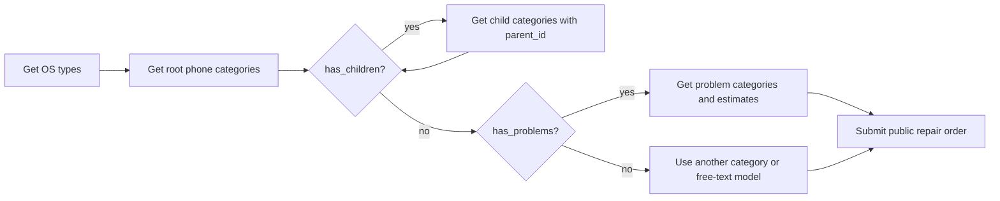

# Public Repair Order and Calculator API Reference

**Status:** Canonical frontend/integration reference  
**Last verified:** 2026-06-15  
**Verified against commit:** `26fcbd8e9a5c919e0310494c25b77952ab955909`

This document defines the implemented HTTP contract for:

- `GET /api/v1/calculator/os-types`
- `GET /api/v1/calculator/phone-categories/{os_type_id}`
- `GET /api/v1/calculator/problem-categories/{phone_category_id}`
- `POST /api/v1/repair-orders/open`

It is based on the current controllers, DTO validation, services, global pipes,
middleware, database migrations, and error filter. Where the runtime behavior differs
from older Swagger examples or frontend guides, this document describes the runtime
behavior.

## 1. Integration Overview

The intended public flow is:



Recommended client behavior:

1. Load OS types.
2. Load root categories for the selected OS.
3. Continue loading children while the selected category has `has_children: true`.
4. Load problems when the category has `has_problems: true`.
5. Submit the selected leaf category UUID, or submit a free-text model if the device is
   not represented in the catalog.

## 2. Shared HTTP Contract

### Base URL

```text
https://<api-host>/api/v1
```

### Authentication

All four endpoints in this reference are callable without an admin bearer token.

The calculator routes have no controller guard and are not registered in the JWT
middleware route lists. `POST /repair-orders/open` is explicitly registered as a public
route.

### Response envelope

These endpoints return their payload directly:

- calculator endpoints return JSON arrays;
- the open repair-order endpoint returns one raw `repair_orders` row.

There is no `{ data, meta }` wrapper.

### Input sanitization and validation

Before controller execution:

1. String input is processed by the global HTML sanitization pipe.
2. DTO validation runs with:
   - unknown properties removed only after validation;
   - unknown properties rejected;
   - implicit type conversion enabled.
3. Validation stops at the first extracted validation error.

### Standard error shape

Controller, validation, and service errors normally use:

```json
{
  "statusCode": 400,
  "message": "Invalid UUID format",
  "error": "BadRequestException",
  "location": "params_id",
  "timestamp": "2026-06-15T10:00:00.000Z",
  "path": "/api/v1/calculator/phone-categories/not-a-uuid"
}
```

`location` may be `null`. Validation errors use `error: "ValidationError"`.

### Maintenance mode

All four routes are subject to maintenance middleware. When the system is not
operational, the middleware currently returns `503` with a smaller response:

```json
{
  "message": "🛠 Texnik ishlar ketmoqda. Iltimos, keyinroq urinib ko‘ring.",
  "location": "maintenance_mode"
}
```

### Rate limiting

`POST /api/v1/repair-orders/open` is limited to **20 requests per 60 seconds per client
IP** by the current application middleware. The counter is shared with the other routes
registered in the same public-route limiter.

A rejected request returns:

```json
{
  "statusCode": 429,
  "message": "Too many requests. Please try again later.",
  "error": "TooManyRequests",
  "location": "rate_limit",
  "timestamp": "2026-06-15T10:00:00.000Z",
  "path": "/api/v1/repair-orders/open"
}
```

The three calculator routes do not currently have an application-level rate limiter.
An API gateway or reverse proxy may still impose infrastructure limits.

---

## 3. GET `/api/v1/calculator/os-types`

Returns every active, non-deleted phone operating-system type.

### Request

```http
GET /api/v1/calculator/os-types
Accept: application/json
```

No path parameters, query parameters, or request body are accepted.

### Selection and ordering

The endpoint selects rows where:

```text
is_active = true
status = "Open"
```

Rows are ordered by `sort ASC`. Ordering between rows with the same `sort` value is not
defined.

### Success response

**Status:** `200 OK`

| Field        | JSON type | Nullable | Description                                         |
| ------------ | --------- | -------- | --------------------------------------------------- |
| `id`         | string    | no       | OS-type UUID.                                       |
| `name_uz`    | string    | no       | Uzbek display name.                                 |
| `name_ru`    | string    | no       | Russian display name.                               |
| `name_en`    | string    | no       | English display name.                               |
| `sort`       | number    | no       | Ascending display order.                            |
| `is_active`  | boolean   | no       | Always `true` for rows returned by this endpoint.   |
| `status`     | string    | no       | Always `"Open"` for rows returned by this endpoint. |
| `created_by` | string    | yes      | UUID of the admin that created the catalog row.     |
| `created_at` | string    | yes      | Timestamp serialized as an ISO date-time string.    |
| `updated_at` | string    | yes      | Timestamp serialized as an ISO date-time string.    |

Example:

```json
[
  {
    "id": "3fa85f64-5717-4562-b3fc-2c963f66afa6",
    "name_uz": "iOS",
    "name_ru": "iOS",
    "name_en": "iOS",
    "sort": 1,
    "is_active": true,
    "status": "Open",
    "created_by": "a3f02a74-88c5-4ed8-aef5-a6984bf1768e",
    "created_at": "2026-06-01T08:00:00.000Z",
    "updated_at": "2026-06-01T08:00:00.000Z"
  }
]
```

If no rows match, the endpoint returns:

```json
[]
```

It does not return `404`.

---

## 4. GET `/api/v1/calculator/phone-categories/{os_type_id}`

Returns one level of the phone-category tree. It supports root navigation, child
navigation, and localized name search.

### Request

```http
GET /api/v1/calculator/phone-categories/{os_type_id}
Accept: application/json
```

### Path parameter

| Parameter    | Required | Validation         | Description                  |
| ------------ | -------- | ------------------ | ---------------------------- |
| `os_type_id` | yes      | UUID-shaped string | Selected OS-type identifier. |

An invalid value returns `400`:

```json
{
  "statusCode": 400,
  "message": "Invalid UUID format",
  "error": "BadRequestException",
  "location": "params_id",
  "timestamp": "2026-06-15T10:00:00.000Z",
  "path": "/api/v1/calculator/phone-categories/not-a-uuid"
}
```

### Query parameters

| Parameter   | Type   | Required | Rules                        | Description                                                   |
| ----------- | ------ | -------- | ---------------------------- | ------------------------------------------------------------- |
| `parent_id` | string | no       | Must be a UUID when present. | Switches the endpoint to child-navigation mode.               |
| `search`    | string | no       | Maximum 100 characters.      | Case-insensitive localized-name filter for the current level. |

Examples:

```http
GET /api/v1/calculator/phone-categories/3fa85f64-5717-4562-b3fc-2c963f66afa6
```

```http
GET /api/v1/calculator/phone-categories/3fa85f64-5717-4562-b3fc-2c963f66afa6?search=iPhone
```

```http
GET /api/v1/calculator/phone-categories/3fa85f64-5717-4562-b3fc-2c963f66afa6?parent_id=4ab85f64-5717-4562-b3fc-2c963f66afa6&search=15%20Pro
```

### Root mode

Root mode is used when `parent_id` is omitted.

The endpoint returns categories where:

```text
phone_os_type_id = os_type_id
parent_id IS NULL
category.is_active = true
category.status = "Open"
OS type.is_active = true
OS type.status = "Open"
```

An unknown, inactive, or deleted `os_type_id` returns `200 []`.

### Child mode

Child mode is used when `parent_id` is present.

The endpoint returns categories where:

```text
category.parent_id = parent_id
category.is_active = true
category.status = "Open"
parent.is_active = true
parent.status = "Open"
```

Current implementation detail: in child mode, `os_type_id` is validated for syntax but
is not used to constrain the query. The server does not verify that `parent_id` belongs
to the OS type in the path. Clients should continue sending the originally selected
`os_type_id` for consistency.

An unknown, inactive, or deleted `parent_id` returns `200 []`.

### Search behavior

When `search` contains non-whitespace text:

- leading and trailing whitespace is removed before querying;
- the comparison is case-insensitive;
- `name_uz`, `name_ru`, and `name_en` are searched;
- the search applies only to the current root or child level;
- matching is substring-based;
- a whitespace-only search behaves as if search were omitted.

The 100-character DTO limit is evaluated before the service trims leading and trailing
spaces. SQL `LIKE` wildcard characters `%` and `_` are not escaped and therefore retain
wildcard behavior.

### Flags

`has_children` is `true` when at least one direct child has:

```text
status = "Open"
is_active = true
```

`has_problems` is `true` when at least one directly mapped problem category has:

```text
status = "Open"
is_active = true
```

The flags are independent. Both may be `true`.

### Success response

**Status:** `200 OK`

Rows are ordered by `sort ASC`.

| Field              | JSON type | Nullable | Description                                                            |
| ------------------ | --------- | -------- | ---------------------------------------------------------------------- |
| `id`               | string    | no       | Phone-category UUID.                                                   |
| `name_uz`          | string    | no       | Uzbek display name.                                                    |
| `name_ru`          | string    | no       | Russian display name.                                                  |
| `name_en`          | string    | no       | English display name.                                                  |
| `telegram_sticker` | string    | yes      | Sticker value or URL stored for the category.                          |
| `phone_os_type_id` | string    | yes      | Associated OS-type UUID. Child rows may rely primarily on `parent_id`. |
| `parent_id`        | string    | yes      | Direct parent UUID; `null` for root rows.                              |
| `sort`             | number    | no       | Ascending display order.                                               |
| `status`           | string    | no       | Always `"Open"` for returned rows.                                     |
| `is_active`        | boolean   | no       | Always `true` for returned rows.                                       |
| `created_by`       | string    | yes      | UUID of the admin that created the row.                                |
| `created_at`       | string    | yes      | ISO date-time string.                                                  |
| `updated_at`       | string    | yes      | ISO date-time string.                                                  |
| `has_children`     | boolean   | no       | Whether an active, open direct child exists.                           |
| `has_problems`     | boolean   | no       | Whether an active, open problem mapping exists.                        |

Example:

```json
[
  {
    "id": "4ab85f64-5717-4562-b3fc-2c963f66afa6",
    "name_uz": "iPhone 15 Pro",
    "name_ru": "iPhone 15 Pro",
    "name_en": "iPhone 15 Pro",
    "telegram_sticker": null,
    "phone_os_type_id": "3fa85f64-5717-4562-b3fc-2c963f66afa6",
    "parent_id": "1db85f64-5717-4562-b3fc-2c963f66afa6",
    "sort": 1,
    "status": "Open",
    "is_active": true,
    "created_by": null,
    "created_at": "2026-06-01T08:00:00.000Z",
    "updated_at": "2026-06-01T08:00:00.000Z",
    "has_children": false,
    "has_problems": true
  }
]
```

### Validation errors

Invalid `parent_id`:

```json
{
  "statusCode": 400,
  "message": "Parent_id must be a UUID",
  "error": "ValidationError",
  "location": "parent_id",
  "timestamp": "2026-06-15T10:00:00.000Z",
  "path": "/api/v1/calculator/phone-categories/3fa85f64-5717-4562-b3fc-2c963f66afa6?parent_id=invalid"
}
```

Overlong `search`:

```json
{
  "statusCode": 400,
  "message": "Search term must be at most 100 characters long",
  "error": "ValidationError",
  "location": "search",
  "timestamp": "2026-06-15T10:00:00.000Z",
  "path": "/api/v1/calculator/phone-categories/3fa85f64-5717-4562-b3fc-2c963f66afa6"
}
```

---

## 5. GET `/api/v1/calculator/problem-categories/{phone_category_id}`

Returns directly mapped, active root problem categories and their current catalog
estimate for one phone category.

### Request

```http
GET /api/v1/calculator/problem-categories/{phone_category_id}
Accept: application/json
```

### Path parameter

| Parameter           | Required | Validation         | Description                                             |
| ------------------- | -------- | ------------------ | ------------------------------------------------------- |
| `phone_category_id` | yes      | UUID-shaped string | Phone category for which repair problems are requested. |

Invalid syntax returns `400` with `message: "Invalid UUID format"` and
`location: "params_id"`.

### Selection behavior

The phone category must be active and open. Returned problems must:

- be directly mapped through `phone_problem_mappings`;
- have `parent_id = null`;
- have `status = "Open"`;
- have `is_active = true`.

Only root problem categories are returned. The endpoint does not recursively return
problem descendants.

The following all return `200 []`:

- unknown phone category;
- inactive or deleted phone category;
- category with no eligible mappings;
- category mapped only to child/non-root problems.

### Cost calculation

For each returned problem:

```text
cost =
  problem.price
  + SUM(part.part_price for directly assigned required parts with status = "Open")
```

Notes:

- optional parts are excluded;
- deleted parts are excluded;
- the endpoint does not return the parts used in the calculation;
- the endpoint does not apply quantity multiplication;
- the endpoint currently does not return `currency_id`;
- the calculation currently adds raw catalog amounts without currency conversion.

Catalog configuration should therefore keep the problem and required-part prices in a
compatible currency until the calculator contract exposes currency information and
conversion rules.

### Success response

**Status:** `200 OK`

Rows are ordered by `sort ASC`.

| Field               | JSON type | Nullable | Description                                            |
| ------------------- | --------- | -------- | ------------------------------------------------------ |
| `id`                | string    | no       | Problem-category UUID.                                 |
| `name_uz`           | string    | no       | Uzbek display name.                                    |
| `name_ru`           | string    | no       | Russian display name.                                  |
| `name_en`           | string    | no       | English display name.                                  |
| `parent_id`         | null      | yes      | Always `null` because only root problems are returned. |
| `price`             | string    | no       | Base service price as a PostgreSQL numeric string.     |
| `estimated_minutes` | number    | no       | Estimated repair duration in minutes.                  |
| `warranty_period`   | number    | no       | Warranty period in months.                             |
| `sort`              | number    | no       | Ascending display order.                               |
| `cost`              | string    | no       | Base price plus eligible required-part prices.         |

Example:

```json
[
  {
    "id": "5ab85f64-5717-4562-b3fc-2c963f66afa6",
    "name_uz": "Ekran almashtirish",
    "name_ru": "Замена экрана",
    "name_en": "Screen replacement",
    "parent_id": null,
    "price": "100000.00000000",
    "estimated_minutes": 60,
    "warranty_period": 3,
    "sort": 1,
    "cost": "1550000.00000000"
  }
]
```

Treat `price` and `cost` as decimal strings. Do not parse them through binary
floating-point arithmetic when exact financial display or calculation matters.

### Flag consistency caveat

`has_problems` on the phone-category endpoint checks for any active, open mapped
problem, including a non-root problem. This endpoint returns only root problems.
Therefore, malformed catalog data can produce `has_problems: true` followed by an empty
problem response.

---

## 6. POST `/api/v1/repair-orders/open`

Creates a public website/app repair application without admin authentication.

### Request

```http
POST /api/v1/repair-orders/open
Content-Type: application/json
Accept: application/json
```

### Request body

All four properties are required. Extra properties are rejected.

| Field            | JSON type | Required | DTO limit          | Behavior                                                |
| ---------------- | --------- | -------- | ------------------ | ------------------------------------------------------- |
| `name`           | string    | yes      | 1-200 characters   | Trimmed; repeated whitespace is collapsed to one space. |
| `phone_number`   | string    | yes      | 1-30 characters    | Normalized to `+998XXXXXXXXX`.                          |
| `phone_category` | string    | yes      | 1-200 characters   | Existing leaf UUID or free-text device/model.           |
| `description`    | string    | yes      | 0-10000 characters | Trimmed; an empty string is accepted.                   |

Recommended free-text payload:

```json
{
  "name": "Asilbek Azimov",
  "phone_number": "+998901234567",
  "phone_category": "iPhone 13 Pro",
  "description": "Screen is broken and the battery drains quickly."
}
```

Catalog UUID payload:

```json
{
  "name": "Asilbek Azimov",
  "phone_number": "901234567",
  "phone_category": "4ab85f64-5717-4562-b3fc-2c963f66afa6",
  "description": "Display cracked after a drop."
}
```

### `name` processing

The stored repair-order name is normalized:

```text
"  Asilbek   Azimov  " -> "Asilbek Azimov"
```

For a newly created customer:

- the first word becomes `first_name`;
- all remaining words become `last_name`;
- the customer is created with `source: "web"`;
- `phone_verified` is `false`;
- `status` is `"Open"`.

If a customer already exists for the normalized phone number, that customer is reused.
Missing first/last name fields may be filled, but existing non-empty name fields are not
overwritten.

### `phone_number` processing

The backend removes non-digit characters and returns/stores a `+998` E.164-style value.

Documented common inputs:

```text
+998901234567       -> +998901234567
998901234567        -> +998901234567
901234567           -> +998901234567
0901234567          -> +998901234567
8901234567          -> +998901234567
+998 (90) 123-45-67 -> +998901234567
```

Exact current rules:

- a value beginning with `+` must have digits beginning with `998`;
- 12 digits beginning with `998` use the final 9 local digits;
- 9 digits are treated as the local number;
- 10 digits beginning with `0` or `8` drop the first digit;
- other non-plus values longer than 9 digits use the final 9 digits;
- inputs that cannot produce exactly 9 local digits are rejected.

Customer lookup checks both normalized `+998XXXXXXXXX` and legacy 9-digit storage.
Legacy customer storage is normalized when an existing customer is reused.

### `phone_category` processing

The value is trimmed and then classified by format.

#### UUID-shaped value

A value matching the hexadecimal `8-4-4-4-12` UUID shape is treated only as a catalog
identifier. It must identify a category with:

```text
status = "Open"
is_active = true
```

It must also have no direct child whose `status` is `"Open"`.

On success, `phone_category_id` is stored.

Important implementation difference: this leaf check does not filter child
`is_active`. The calculator's `has_children` flag does filter child `is_active`.
Catalog data containing an inactive but open child can therefore appear selectable in
the calculator and still be rejected by this endpoint.

#### Non-UUID value

Any non-UUID-shaped value is treated as free text:

- `phone_category_id` is stored as `null`;
- the trimmed model is appended to the description:

```text
Phone category: iPhone 13 Pro
```

A UUID-shaped value that is unknown or inactive is not treated as free text; it returns
`400`.

### `description` processing

The description is trimmed.

If it is empty and a catalog UUID is used, the stored value is `null`.

If free-text `phone_category` is used:

```text
<trimmed description>
Phone category: <trimmed phone_category>
```

The separator is one newline. If the original description is empty, only the phone
category line is stored.

The final combined value must not exceed 10,000 characters.

### Server-assigned values and side effects

The endpoint performs one database transaction that:

1. Requires the active Mother Branch with ID
   `00000000-0000-4000-8000-000000000000`.
2. Chooses the first active, open, protected status of type `Open`, ordered by `sort`.
3. Falls back to the first active, open status of type `Open` if no protected status
   exists.
4. Requires an active base currency and stores it in `pricing_currency_id`.
5. Creates or reuses the customer.
6. Creates the repair order with:
   - `priority: "Medium"`;
   - `priority_level: 2`;
   - `pickup_method: "Self"`;
   - `delivery_method: "Self"`;
   - `source: "Web"`;
   - `created_by: null`;
   - initial insert `sort: 999999`.
7. Moves the persisted order to the top of its branch/status list (`sort = 1`).
8. Assigns a fallback active operator using the current round-robin assignment logic
   when possible.
9. Records creation history.

After commit, notification and outgoing-webhook delivery are initiated. Their success
is not part of the HTTP success contract.

### Idempotency

The endpoint does not accept an idempotency key and does not deduplicate repair orders.
Repeated submissions create multiple repair orders even though they reuse the same
customer.

Clients should disable repeated submission while a request is pending.

### Success response

**Status:** `201 Created`

The response is the raw row captured by `INSERT ... RETURNING *`. It is not the
authenticated admin detail model.

Runtime type notes:

- `number_id` is a JSON string because PostgreSQL `bigint` is returned by `pg` as a
  string;
- `total` is a decimal string;
- UUIDs are strings;
- timestamps serialize as ISO date-time strings;
- nullable database columns are returned as `null`.

| Field                         | JSON type      | Typical new-order value | Description                                                         |
| ----------------------------- | -------------- | ----------------------- | ------------------------------------------------------------------- |
| `id`                          | string         | generated UUID          | Repair-order UUID.                                                  |
| `number_id`                   | string         | `"1024"`                | Human-facing sequence number.                                       |
| `user_id`                     | string         | generated/reused UUID   | Linked customer.                                                    |
| `branch_id`                   | string         | Mother Branch UUID      | Server-selected branch.                                             |
| `total`                       | string         | `"0.00000000"`          | Current order total.                                                |
| `pricing_currency_id`         | string         | base currency UUID      | Active base currency at creation.                                   |
| `imei`                        | null           | `null`                  | Not collected by this endpoint.                                     |
| `phone_category_id`           | string or null | UUID or `null`          | Set only for a catalog UUID.                                        |
| `status_id`                   | string         | selected status UUID    | Server-selected initial status.                                     |
| `delivery_method`             | string         | `"Self"`                | Server default.                                                     |
| `pickup_method`               | string         | `"Self"`                | Server default.                                                     |
| `sort`                        | number         | `999999`                | Value in the returned insert object; persisted row is moved to `1`. |
| `priority`                    | string         | `"Medium"`              | Server default.                                                     |
| `priority_level`              | number         | `2`                     | Database default.                                                   |
| `agreed_date`                 | null           | `null`                  | Not collected.                                                      |
| `reject_cause_id`             | null           | `null`                  | Not applicable at creation.                                         |
| `region_id`                   | null           | `null`                  | Not collected.                                                      |
| `created_by`                  | null           | `null`                  | Public submission has no admin creator.                             |
| `status`                      | string         | `"Open"`                | Row lifecycle status.                                               |
| `phone_number`                | string         | `"+998901234567"`       | Normalized phone.                                                   |
| `name`                        | string         | normalized input        | Full customer name.                                                 |
| `description`                 | string or null | normalized input        | May include the free-text category line.                            |
| `source`                      | string         | `"Web"`                 | Public website/app source.                                          |
| `call_count`                  | number         | `0`                     | Call counter.                                                       |
| `missed_calls`                | number         | `0`                     | Missed-call counter.                                                |
| `customer_no_answer_count`    | number         | `0`                     | Customer no-answer counter.                                         |
| `last_customer_no_answer_at`  | null           | `null`                  | No-answer timestamp.                                                |
| `customer_no_answer_due_at`   | null           | `null`                  | No-answer follow-up deadline.                                       |
| `lead_indicator_type`         | null           | `null`                  | No lead indicator at creation.                                      |
| `lead_indicator_color`        | null           | `null`                  | No lead indicator at creation.                                      |
| `lead_indicator_triggered_at` | null           | `null`                  | No lead indicator at creation.                                      |
| `lead_indicator_cleared_at`   | null           | `null`                  | No lead indicator at creation.                                      |
| `lead_indicator_cleared_by`   | null           | `null`                  | No lead indicator at creation.                                      |
| `created_at`                  | string         | current timestamp       | ISO date-time string.                                               |
| `updated_at`                  | string         | current timestamp       | ISO date-time string.                                               |

Example free-text response:

```json
{
  "id": "7c54c7bd-c01e-4e95-ae70-c88283f61f2b",
  "number_id": "1024",
  "user_id": "9583be3b-9e19-4b3d-a110-7ec44ce734f7",
  "branch_id": "00000000-0000-4000-8000-000000000000",
  "total": "0.00000000",
  "pricing_currency_id": "8011be78-986f-4ef2-9841-bc4de40f2e16",
  "imei": null,
  "phone_category_id": null,
  "status_id": "2a56dc59-7966-47a5-960a-9b7d3c8f9d99",
  "delivery_method": "Self",
  "pickup_method": "Self",
  "sort": 999999,
  "priority": "Medium",
  "priority_level": 2,
  "agreed_date": null,
  "reject_cause_id": null,
  "region_id": null,
  "created_by": null,
  "status": "Open",
  "phone_number": "+998901234567",
  "name": "Asilbek Azimov",
  "description": "Screen is broken.\nPhone category: iPhone 13 Pro",
  "source": "Web",
  "call_count": 0,
  "missed_calls": 0,
  "customer_no_answer_count": 0,
  "last_customer_no_answer_at": null,
  "customer_no_answer_due_at": null,
  "lead_indicator_type": null,
  "lead_indicator_color": null,
  "lead_indicator_triggered_at": null,
  "lead_indicator_cleared_at": null,
  "lead_indicator_cleared_by": null,
  "created_at": "2026-06-15T10:00:00.000Z",
  "updated_at": "2026-06-15T10:00:00.000Z"
}
```

Clients should display `number_id` but should not depend on the returned `sort`.

### Validation and business errors

Possible exact messages include:

| Status | Location         | Message                                                     |
| ------ | ---------------- | ----------------------------------------------------------- |
| `400`  | `name`           | `Name must be a string`                                     |
| `400`  | `name`           | `Name must not be empty`                                    |
| `400`  | `name`           | `Name must not exceed 200 characters`                       |
| `400`  | `phone_number`   | `Phone number must be a string`                             |
| `400`  | `phone_number`   | `Phone number must not be empty`                            |
| `400`  | `phone_number`   | `Phone number must not exceed 30 characters`                |
| `400`  | `phone_number`   | `Phone number must be an Uzbekistan phone number`           |
| `400`  | `phone_number`   | `Phone number must match Uzbekistan phone number structure` |
| `400`  | `phone_category` | `Phone category must be a string`                           |
| `400`  | `phone_category` | `Phone category must not be empty`                          |
| `400`  | `phone_category` | `Phone category must not exceed 200 characters`             |
| `400`  | `phone_category` | `Phone category not found or inactive`                      |
| `400`  | `phone_category` | `Phone category must not have children`                     |
| `400`  | `description`    | `Description must be a string`                              |
| `400`  | `description`    | `Description must not exceed 10000 characters`              |
| `400`  | `branch_id`      | `Mother Branch is not active for public applications`       |
| `400`  | `branch_id`      | `No active open repair order status found for this branch`  |
| `422`  | `currency_id`    | `An active base currency must be configured`                |

The `422` response also includes:

```json
{
  "code": "BASE_CURRENCY_NOT_CONFIGURED"
}
```

Unknown properties produce a validation error such as:

```json
{
  "statusCode": 400,
  "message": "Property 'email' is not allowed",
  "error": "ValidationError",
  "location": "email",
  "timestamp": "2026-06-15T10:00:00.000Z",
  "path": "/api/v1/repair-orders/open"
}
```

Database uniqueness races may return `409 Conflict` with
`error: "ConflictError"`. Unexpected application/database errors return `500`.

---

## 7. TypeScript Integration Example

```ts
type LocalizedCatalogItem = {
  id: string;
  name_uz: string;
  name_ru: string;
  name_en: string;
};

type PhoneCategory = LocalizedCatalogItem & {
  parent_id: string | null;
  phone_os_type_id: string | null;
  telegram_sticker: string | null;
  sort: number;
  status: 'Open';
  is_active: true;
  created_by: string | null;
  created_at: string;
  updated_at: string;
  has_children: boolean;
  has_problems: boolean;
};

type ProblemCategory = LocalizedCatalogItem & {
  parent_id: null;
  price: string;
  estimated_minutes: number;
  warranty_period: number;
  sort: number;
  cost: string;
};

type OpenRepairOrderInput = {
  name: string;
  phone_number: string;
  phone_category: string;
  description: string;
};

type OpenRepairOrderResult = {
  id: string;
  number_id: string;
  user_id: string;
  phone_category_id: string | null;
  phone_number: string;
  name: string;
  description: string | null;
  source: 'Web';
  total: string;
  pricing_currency_id: string;
  sort: number;
  created_at: string;
};

async function requestJson<T>(url: string, init?: RequestInit): Promise<T> {
  const response = await fetch(url, init);
  const body = await response.json();

  if (!response.ok) {
    throw body;
  }

  return body as T;
}

async function getPhoneCategories(
  apiBaseUrl: string,
  osTypeId: string,
  options: { parentId?: string; search?: string } = {},
): Promise<PhoneCategory[]> {
  const query = new URLSearchParams();
  if (options.parentId) query.set('parent_id', options.parentId);
  if (options.search) query.set('search', options.search);

  const suffix = query.size ? `?${query.toString()}` : '';
  return requestJson(`${apiBaseUrl}/api/v1/calculator/phone-categories/${osTypeId}${suffix}`);
}

async function createOpenRepairOrder(
  apiBaseUrl: string,
  input: OpenRepairOrderInput,
): Promise<OpenRepairOrderResult> {
  return requestJson(`${apiBaseUrl}/api/v1/repair-orders/open`, {
    method: 'POST',
    headers: { 'Content-Type': 'application/json' },
    body: JSON.stringify(input),
  });
}
```

## 8. Client Acceptance Checklist

- Treat calculator `200 []` as an empty state, not an exception.
- Use localized names based on the selected UI language.
- Continue tree navigation using `parent_id`.
- Submit only a leaf category UUID; otherwise submit free-text model text.
- Treat `price`, `cost`, `total`, and `number_id` as strings.
- Do not assume calculator prices include an exposed currency.
- Do not depend on the `sort` returned by the open-order response.
- Map errors to fields using `location`.
- Handle `400`, `409`, `422`, `429`, `500`, and `503`.
- Prevent duplicate form submissions on the client.

## 9. Implementation Sources

Primary source files:

- `src/calculator/calculator.controller.ts`
- `src/calculator/calculator.service.ts`
- `src/calculator/dto/phone-categories-query.dto.ts`
- `src/calculator/dto/calculator-response.dto.ts`
- `src/repair-orders/repair-orders.controller.ts`
- `src/repair-orders/repair-orders.service.ts`
- `src/repair-orders/dto/open-repair-order-application.dto.ts`
- `src/common/filters/http-exception.filter.ts`
- `src/common/pipe/parse-uuid.pipe.ts`
- `src/common/utils/validation.util.ts`
- `src/config/public.routes.ts`
- `src/main.ts`
