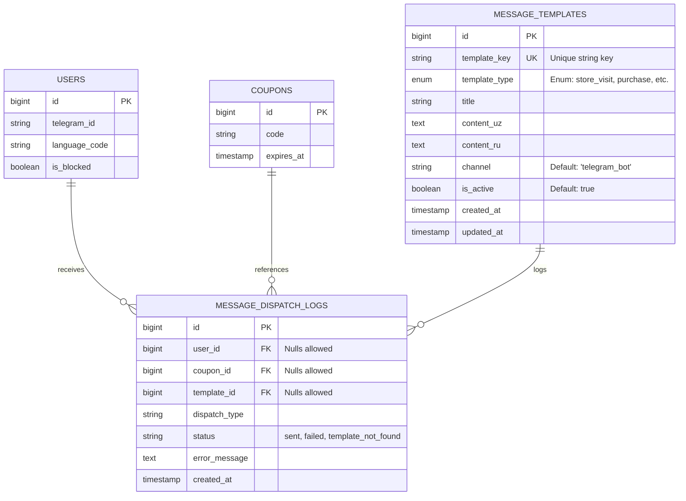
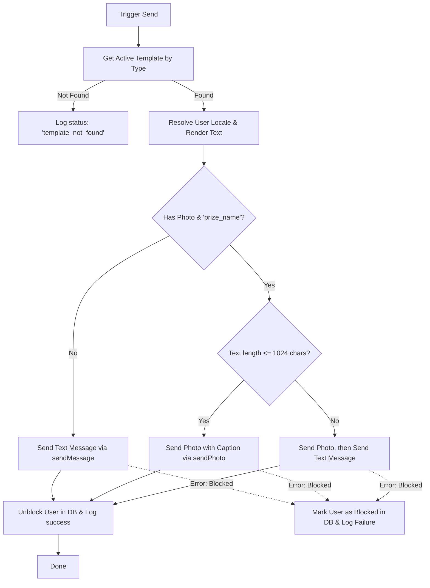

# Transactional Message Template System

This document outlines the architecture, database schema, user experience (UX) flows, and technical implementation of the Transactional Message Template System in the Probox Telegram Bot. It is designed to serve as a shareable reference guide for porting this architecture to other projects.

---

## 1. System Overview & Key Features

The Transactional Message Template System handles automated, multilingual notifications sent to users via Telegram. Rather than hardcoding copy inside backend services, messages are dynamic, stored in a database, and manageable by administrators.

### Core Capabilities

1. **Multilingual Content Rendering**: Supports localized fields (`uz` for Uzbek and `ru` for Russian). Resolves the text content dynamically based on the recipient's preference, falling back to Uzbek if unspecified.
2. **Dynamic Placeholders**: Uses a regular expression rendering engine to parse and replace curly brace placeholders (e.g., `{{ customer_name }}`) with contextual metadata.
3. **Telegram-Optimized UX Rules**:
   - **Click-to-Copy Rewards**: Automatically wraps the `{{ coupon_code }}` placeholder in HTML `<code>` tags (if not already wrapped) so users can tap to copy codes directly in Telegram.
   - **Smart Media Splitting**: Telegram enforces a strict **1024-character limit** on text captions sent with photos. If a rendered message contains an image and exceeds 1024 characters, the system splits it: it sends the image first, followed by the full text as a separate text message.
4. **Resilience & Block Handling**: Catches Telegram API errors when a user has blocked the bot. It automatically updates the user's database status to blocked. When the user restarts/interacts with the bot, it unblocks them, ensuring we do not repeatedly invoke failed API calls.
5. **Auditing & Logging**: Every dispatch attempts writes log events to the database (`message_dispatch_logs`), recording the delivery status (`sent`, `failed`, `template_not_found`) and any exception details.
6. **Interactive Admin CRUD UI**: A conversational interface inside the bot allows admins to review, edit, create, activate/deactivate, and delete templates without writing code or editing database tables manually.

---

## 2. Database Architecture

The system uses two tables: `message_templates` for configuration and `message_dispatch_logs` for tracking.

### Entity Relationship Diagram



### Table Definitions (Knex.js Migrations)

#### Message Templates Schema
Defined in [20260327103500_create_message_templates.ts](file:///d:/Shakhzod/Javascript/Probox_TelegramBot/src/database/migrations/20260327103500_create_message_templates.ts):
```typescript
table.bigIncrements("id").primary();
table.string("template_key", 120).notNullable().unique();
table.enu("template_type", [
    "store_visit",
    "purchase",
    "referral",
    "payment_reminder_d2",
    "payment_reminder_d1",
    "payment_reminder_d0",
    "payment_paid_on_time",
    "payment_overdue",
    "payment_paid_late",
    "winner_notification"
], {
    useNative: true,
    enumName: "message_template_type",
}).notNullable();
table.string("title", 255).notNullable();
table.text("content_uz").notNullable();
table.text("content_ru").notNullable();
table.string("channel", 50).notNullable().defaultTo("telegram_bot");
table.boolean("is_active").notNullable().defaultTo(true);
table.timestamp("created_at").defaultTo(knex.fn.now());
table.timestamp("updated_at").defaultTo(knex.fn.now());

// Indexes for query performance
table.index(["template_type"]);
table.index(["is_active"]);
```

#### Message Dispatch Logs Schema
Defined in [20260328110400_create_message_dispatch_logs.ts](file:///d:/Shakhzod/Javascript/Probox_TelegramBot/src/database/migrations/20260328110400_create_message_dispatch_logs.ts):
```typescript
table.bigIncrements("id").primary();
table.bigInteger("user_id").nullable().references("id").inTable("users").onDelete("SET NULL");
table.bigInteger("coupon_id").nullable().references("id").inTable("coupons").onDelete("SET NULL");
table.bigInteger("template_id").nullable().references("id").inTable("message_templates").onDelete("SET NULL");
table.string("dispatch_type", 50).notNullable();
table.string("status", 50).notNullable();
table.text("error_message").nullable();
table.timestamp("created_at").defaultTo(knex.fn.now());

table.index(["user_id"]);
table.index(["coupon_id"]);
table.index(["dispatch_type"]);
```

---

## 3. Technical Implementation Details

The core functionality spans a rendering and CRUD service layer, a notification delivery layer, and UI keyboards.

### 3.1. Rendering Engine
The template rendering engine is implemented in [message-template.service.ts](file:///d:/Shakhzod/Javascript/Probox_TelegramBot/src/services/message-template.service.ts):
- It fetches the text based on the user's preferred language.
- It scans the text for `{{ placeholder }}` tokens using a regular expression.
- It performs Telegram-specific styling optimizations.

```typescript
static render(
  template: MessageTemplate,
  locale: string,
  placeholders: Record<string, string | number | null | undefined>,
): string {
  const raw = this.getContent(template, locale); // Locale switcher: locale === 'ru' ? content_ru : content_uz

  return raw.replace(/\{\{\s*([a-zA-Z0-9_]+)\s*\}\}/g, (match, key: string, offset: number) => {
    const value = placeholders[key];
    if (value === null || value === undefined || value === '') {
      return '';
    }
    
    const stringValue = String(value);
    
    // Telegram click-to-copy helper for coupon codes
    if (key === 'coupon_code') {
      const prefix = raw.substring(Math.max(0, offset - 6), offset);
      const suffix = raw.substring(offset + match.length, offset + match.length + 7);
      
      // Prevent double wrapping if the author already placed <code></code> around it
      if (prefix.toLowerCase().endsWith('<code>') && suffix.toLowerCase().startsWith('</code>')) {
        return stringValue;
      }
      return `<code>${stringValue}</code>`;
    }
    
    return stringValue;
  });
}
```

### 3.2. Delivery Pipeline
The notification pipeline is managed by [bot-notification.service.ts](file:///d:/Shakhzod/Javascript/Probox_TelegramBot/src/services/bot-notification.service.ts). It implements the following logic:



Here is the corresponding implementation of the delivery logic:
```typescript
const locale = params.user.language_code || 'uz';
const text = MessageTemplateService.render(params.template, locale, params.placeholders);
const bot = await this.getBot();

// Checks if we should attach a prize image loaded from MinIO
const shouldAttachPrizePhoto =
  Boolean(params.photo) &&
  MessageTemplateService.hasPlaceholder(params.template, locale, 'prize_name');

if (shouldAttachPrizePhoto && params.photo) {
  const photo = new InputFile(params.photo.buffer, params.photo.fileName || 'prize.jpg');

  if (text.length <= 1024) {
    // Fits within Telegram caption limit
    await bot.api.sendPhoto(params.user.telegram_id, photo, {
      caption: text,
      parse_mode: 'HTML',
    });
  } else {
    // Exceeds caption limit, send separately to avoid Telegram API exceptions
    await bot.api.sendPhoto(params.user.telegram_id, photo);
    await bot.api.sendMessage(params.user.telegram_id, text, { parse_mode: 'HTML' });
  }
} else {
  // Standard text message
  await bot.api.sendMessage(params.user.telegram_id, text, { parse_mode: 'HTML' });
}
```

---

## 4. Administrative UX / UI Flows

Administrators configure templates directly inside the bot interface, ensuring that managers can tweak the copy, activate or deactivate specific campaigns, or delete deprecated content instantly.

### 4.1. Navigation & Views

- **Main Entrypoint**: Accessed via the admin dashboard button `admin_scheduled_broadcasts` or `admin_campaign_templates`.
- **List View**: Displays all templates sorted by type. A green circle emoji (🟢) indicates active templates, while a black circle (⚫) indicates inactive ones.
- **Detail Card**: Displays the template's metadata, key, type, title, status, and side-by-side previews of the Uzbek and Russian translations. Inline keyboard options allow edits or deletions.

```text
+------------------------------------------+
|  🟢 Template Detail Card                 |
|                                          |
|  Title: Purchase Thank You               |
|  Key: purchase_default                   |
|  Type: purchase                          |
|  Status: Active                          |
|                                          |
|  🇺🇿 UZ Content:                           |
|  Xaridingiz uchun rahmat, {{customer_name}}!|
|                                          |
|  🇷🇺 RU Content:                           |
|  Спасибо за покупку, {{customer_name}}!  |
|                                          |
|  [Edit Key]          [Edit Type]         |
|  [Edit Title]                            |
|  [Edit UZ Content]   [Edit RU Content]   |
|  [Deactivate]                            |
|  [Delete]                                |
|  [< Back to Templates]                   |
+------------------------------------------+
```

### 4.2. Conversational Form Management (Grammy Conversations)
Editing or creating templates requires multi-step text inputs. To prevent these inputs from colliding with other bot handlers, the system uses `@grammyjs/conversations`.

#### UX Code Pattern for Text Prompts
To handle cancellations gracefully during text prompts, the bot uses a dedicated wait loop:
```typescript
const waitForText = async (
  conversation: BotConversation,
  ctx: BotContext,
  locale: string,
  prompt: string,
): Promise<string | null> => {
  await ctx.reply(prompt, { reply_markup: getCancelKeyboard(locale), parse_mode: 'HTML' });

  while (true) {
    const messageCtx = await conversation.waitFor('message:text');
    const value = messageCtx.message.text.trim();

    if (value === i18n.t(locale, 'admin_cancel')) {
      await messageCtx.reply(i18n.t(locale, 'admin_cancelled'), {
        reply_markup: getAdminMenuKeyboard(locale),
      });
      return null; // Signals cancel request to caller
    }

    return value;
  }
};
```

#### Safe State Isolation
When editing templates, the admin's selection is stored in their session state before initiating the conversation:
```typescript
// bot.ts callback dispatcher:
ctx.session.adminTemplateEditTarget = { templateId, field: 'content_uz' };
await ctx.conversation.enter('adminTemplateEditConversation');
```
Inside the conversation, the target field is read securely, preventing overlaps if multiple admins are customizing templates concurrently:
```typescript
// admin-template.conversation.ts:
const target = adminSession?.adminTemplateEditTarget;
// Ask prompt based on target.field and write to database...
```

---

## 5. Transactional Template Registry

Below is a detailed registry of the transactional templates used across the application:

| Template Type | Injected Placeholders | Trigger Event / Context | Business Goal / Purpose |
| :--- | :--- | :--- | :--- |
| `store_visit` | `customer_name`, `coupon_code`, `payment_due_date` | Registered a physical branch visit. | Acknowledges the visit and offers a reward coupon. |
| `purchase` | `customer_name`, `coupon_code`, `product_name`, `payment_due_date` | Successfully completed a purchase transaction. | Thanks the customer, lists the items purchased, and details any earned rewards. |
| `referral` | `customer_name`, `coupon_code`, `referrer_name` | A referred user registers an account. | Rewards the referrer with a coupon for bringing in a new customer. |
| `payment_reminder_d2` | `customer_name`, `payment_due_date`, `product_name` | Chron task running 2 days before installment due date. | Gentle reminder of an upcoming payment deadline. |
| `payment_reminder_d1` | `customer_name`, `payment_due_date`, `product_name` | Chron task running 1 day before installment due date. | Urgent reminder of tomorrow's deadline. |
| `payment_reminder_d0` | `customer_name`, `payment_due_date`, `product_name` | Chron task running on the due date. | Final day reminder to pay installment. |
| `payment_paid_on_time`| `customer_name`, `coupon_code`, `payment_due_date`, `product_name` | Installment paid on or before the due date. | Rewards the customer with a coupon code for timely payments. |
| `payment_overdue` | `customer_name`, `payment_due_date`, `product_name` | Installment becomes overdue. | Alerts the user that their account is overdue, prompting payment. |
| `payment_paid_late` | `customer_name`, `payment_due_date`, `product_name` | Overdue installment is paid. | Confirms receipt of payment, acknowledging completion. |
| `winner_notification` | `customer_name`, `coupon_code`, `prize_name` | Admin draws a promotion winner. | Notifies the winning user with details and an optional prize image. |

---

## 6. How to Replicate this in Another Project (Developer Blueprint)

To implement a similar template message architecture on another project, follow these five steps:

### Step 1: Initialize the Database Schemas
Create a Knex/SQL migration that mirrors the `message_templates` and `message_dispatch_logs` tables. Ensure you create indices on:
- `template_type` (for fast lookups during events)
- `is_active` (to filter deactivated configurations)
- `user_id` and `dispatch_type` (for logging and analytics)

### Step 2: Set up Localized Content & Swapping
If you support multiple languages, store localized content in separate columns (e.g., `content_en`, `content_es`) rather than structured JSON. Flat columns make direct edits via SQL or admin bots simpler and less error-prone. Provide a helper method to resolve the language:
```javascript
const text = locale === 'ru' ? template.content_ru : template.content_uz;
```

### Step 3: Implement the Regex Render Layer
Write a utility function using regular expressions to swap out placeholders. Ensure it:
1. Tolerates variable spacing: `/\{\{\s*([a-zA-Z0-9_]+)\s*\}\}/g` matches `{{placeholder}}` and `{{  placeholder  }}`.
2. Handles platform-specific formatting rules (e.g., click-to-copy HTML wrapping for reward codes).
3. Safely ignores missing keys or replaces them with a fallback string (like `"Customer"` or `""`).

### Step 4: Write the Dispatcher & Error Wrapper
Create a notification service class. Do not send messages directly from database transactions or business logic. Instead, pass the user entity and placeholders to the dispatcher, which should:
1. Fetch the active template version.
2. Check for message length limits (e.g. Telegram's 1024-character caption limit for photos).
3. Catch API errors: if the channel reports a blocked user, mark that user as inactive in your database to prevent future spam blocks.
4. Record the outcome in `message_dispatch_logs`.

### Step 5: Implement Admin Bot Conversations
Design the management flows using a conversation library (such as `@grammyjs/conversations` or equivalent middleware for your framework):
1. **Always check for cancellations** in every step of the conversation loop.
2. **Isolate state** by keeping the target template ID and field in the session, cleaning it up in a `finally` block if the flow exits or fails.
3. Provide keyboard builders that visually separate metadata edits from localized content edits.
