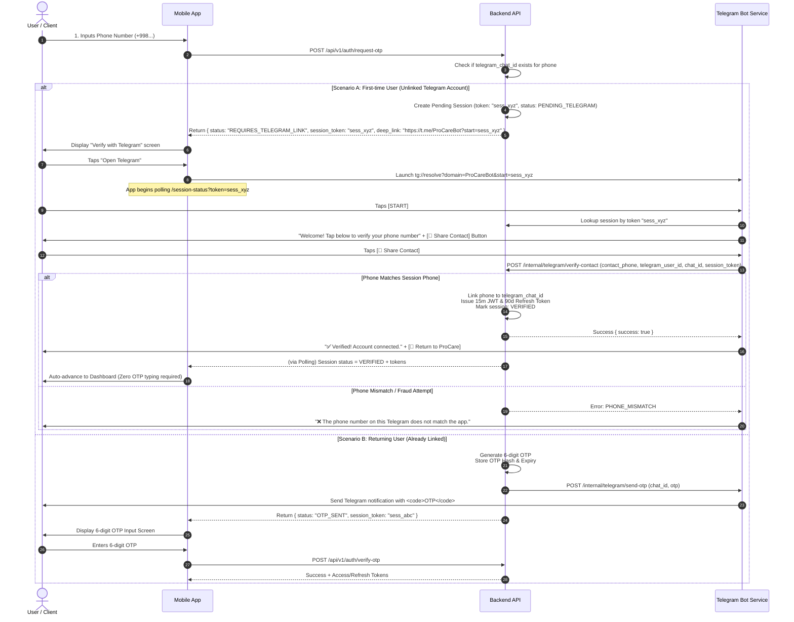
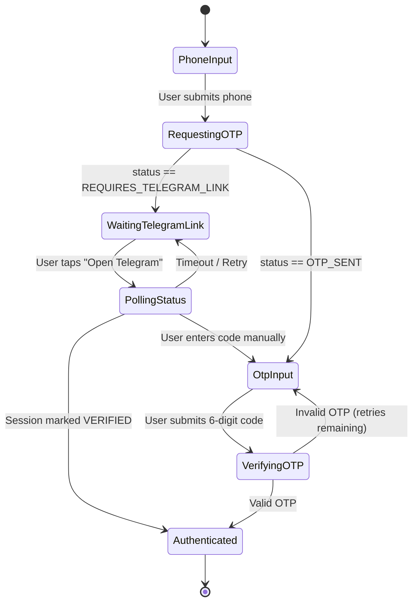

# ProCare System Architecture & Implementation Specification

## Telegram Bot OTP-Only Registration & Authentication Flow

**Document Version:** 1.0.0  
**Target Services:** ProCare Mobile Client, ProCare Backend API, ProCare Telegram Bot Service

---

## 1. System Overview & Problem Statement

ProCare is deprecating SMS-based OTP delivery in favor of direct OTP delivery via ProCare's official Telegram Bot.

### Core Constraints & Challenges

1. **Telegram Anti-Spam Barrier:** A Telegram bot cannot initiate a direct message (`sendMessage`) to any user who has not previously initiated a chat session by pressing `/start`.
2. **Identity Verification:** Anyone can enter another person's phone number in the mobile application. The Telegram Bot cannot simply issue an OTP upon receiving a `/start` command; it must cryptographically verify that the Telegram account belongs to the owner of that phone number.
3. **Frictionless Onboarding:** First-time users who have never used the bot must experience a clean, guided transition without feeling stuck or confused.

---

## 2. End-to-End Sequence Diagram



---

## 3. Data Models & Database Schemas

### 3.1. `users` Table (or Collection)

| Field              | Type        | Description                                               |
| :----------------- | :---------- | :-------------------------------------------------------- |
| `id`               | UUID        | Primary user identifier                                   |
| `phone_number`     | VARCHAR(20) | E.164 normalized phone number (unique, indexed)           |
| `telegram_chat_id` | BIGINT      | Telegram Chat ID for direct messaging (nullable, indexed) |
| `telegram_user_id` | BIGINT      | Telegram User ID (for identity validation)                |
| `status`           | ENUM        | `ACTIVE`, `BLOCKED`, `PENDING_REGISTRATION`               |
| `created_at`       | TIMESTAMP   | Creation timestamp                                        |

### 3.2. `auth_sessions` Table (Redis or Relational Table)

For high performance, storing active auth sessions in **Redis** with a 5-minute TTL is recommended:

```json
Key: "auth_session:sess_a8f9b2"
Value: {
  "session_token": "sess_a8f9b2",
  "phone_number": "+998901234567",
  "telegram_chat_id": null,
  "status": "PENDING_TELEGRAM", // Values: PENDING_TELEGRAM, OTP_SENT, VERIFIED, EXPIRED
  "otp_hash": "$2b$10$...",      // Bcrypt/Argon2 of 6-digit OTP (if generated)
  "attempts_left": 3,
  "auth_token": null,            // Pre-generated JWT once verified
  "created_at": 1773729900,
  "expires_at": 1773730200
}
```

---

## 4. Backend API Specifications

### 4.1. `POST /api/v1/auth/request-otp`

Initiates authentication or registration.

- **Request Body:**

```json
{
  "phone_number": "+998901234567"
}
```

- **Response A (User already linked to Telegram):**

```json
{
  "status": "OTP_SENT",
  "session_token": "sess_e9c1d3",
  "expires_in": 180,
  "message": "OTP has been sent to your registered Telegram account."
}
```

- **Response B (User unlinked / New user):**

```json
{
  "status": "REQUIRES_TELEGRAM_LINK",
  "session_token": "sess_a8f9b2",
  "deep_link": "https://t.me/ProCareAuthBot?start=sess_a8f9b2",
  "tg_app_link": "tg://resolve?domain=ProCareAuthBot&start=sess_a8f9b2",
  "expires_in": 300,
  "message": "Please open Telegram to connect your account and receive your verification code."
}
```

---

### 4.2. `GET /api/v1/auth/session-status`

Used by the mobile client to poll or listen via SSE/WebSocket while waiting for the user to complete Telegram actions.

- **Query Parameters:** `?session_token=sess_a8f9b2`
- **Response (Still waiting in Telegram):**

```json
{
  "status": "PENDING_TELEGRAM"
}
```

- **Response (Verified via Telegram Contact Sharing):**

```json
{
  "status": "VERIFIED",
  "is_new_user": true,
  "access_token": "eyJhbGciOi...",
  "refresh_token": "dGhpcy1pcy1h...",
  "user": {
    "id": "c71a3962-e613-4011-85b1-d30e3cb39ca7",
    "phone_number": "+998901234567"
  }
}
```

---

### 4.3. `POST /api/v1/auth/verify-otp`

Used in Scenario B (and as fallback) when the user submits the 6-digit OTP code received in their Telegram chat.

- **Request Body:**

```json
{
  "session_token": "sess_e9c1d3",
  "otp": "482109"
}
```

- **Response:**

```json
{
  "status": "SUCCESS",
  "access_token": "eyJhbGciOi...",
  "refresh_token": "dGhpcy1pcy1h...",
  "user": {
    "id": "c71a3962-e613-4011-85b1-d30e3cb39ca7",
    "phone_number": "+998901234567"
  }
}
```

---

### 4.4. Internal Bot-to-Backend API: `POST /internal/telegram/verify-contact`

Used exclusively by the Telegram Bot worker.

- **Request Body:**

```json
{
  "session_token": "sess_a8f9b2",
  "telegram_user_id": 123456789,
  "telegram_chat_id": 123456789,
  "contact_phone": "+998901234567",
  "contact_user_id": 123456789
}
```

- **Security Verification Step (Critical):**

```typescript
// Ensure the contact shared actually belongs to the sender
if (contact_user_id !== telegram_user_id) {
  return res.status(403).json({ error: 'SENDER_NOT_CONTACT_OWNER' });
}

// Compare normalized E.164 phone numbers
if (normalizePhone(contact_phone) !== normalizePhone(session.phone_number)) {
  return res.status(400).json({ error: 'PHONE_NUMBER_MISMATCH' });
}
```

---

## 5. Telegram Bot Implementation Details

### 5.1. Handling `/start <payload>`

When the user clicks the deep link in the mobile app, Telegram opens with `/start sess_a8f9b2`.

```typescript
bot.onText(/\/start (.+)/, async (msg, match) => {
  const chatId = msg.chat.id;
  const sessionToken = match[1]; // "sess_a8f9b2"

  // 1. Validate session token with Backend
  const session = await backendService.getSession(sessionToken);
  if (!session || session.status !== 'PENDING_TELEGRAM') {
    return bot.sendMessage(
      chatId,
      "⚠️ Ushbu havola eskirgan yoki yaroqsiz. Iltimos, ilovadan qayta urinib ko'ring.",
    );
  }

  // 2. Temporarily save sessionToken against chatId in cache (TTL: 5m)
  await redis.set(`tg_chat_session:${chatId}`, sessionToken, 'EX', 300);

  // 3. Prompt user with a single native Contact Request button
  await bot.sendMessage(
    chatId,
    "👋 <b>ProCare tizimiga xush kelibsiz!</b>\n\nIlovadagi ro'yxatdan o'tishni tasdiqlash uchun pastdagi tugmani bosing:",
    {
      parse_mode: 'HTML',
      reply_markup: {
        keyboard: [
          [
            {
              text: '📱 Telefon raqamni yuborish',
              request_contact: true,
            },
          ],
        ],
        resize_keyboard: true,
        one_time_keyboard: true,
      },
    },
  );
});
```

### 5.2. Handling Incoming Contact

```typescript
bot.on('contact', async (msg) => {
  const chatId = msg.chat.id;
  const contact = msg.contact;
  const sessionToken = await redis.get(`tg_chat_session:${chatId}`);

  if (!sessionToken) {
    return bot.sendMessage(chatId, 'Aktiv tasdiqlash sessiyasi topilmadi.');
  }

  // Anti-Spoofing check
  if (contact.user_id !== msg.from.id) {
    return bot.sendMessage(chatId, "❌ Iltimos, faqat o'zingizning shaxsiy raqamingizni yuboring.");
  }

  const result = await backendService.verifyContact({
    session_token: sessionToken,
    telegram_user_id: msg.from.id,
    telegram_chat_id: chatId,
    contact_phone: contact.phone_number,
    contact_user_id: contact.user_id,
  });

  if (result.success) {
    // Hide keyboard and display confirmation
    await bot.sendMessage(
      chatId,
      '✅ <b>Raqamingiz muvaffaqiyatli tasdiqlandi!</b>\n\nTelegram hisobingiz ProCare ilovasiga ulandi. Ilovaga qaytib foydalanishingiz mumkin.',
      {
        parse_mode: 'HTML',
        reply_markup: {
          inline_keyboard: [
            [
              {
                text: '📲 ProCare ilovasiga qaytish',
                url: 'procare://auth/verify',
              },
            ],
          ],
        },
      },
    );
  } else if (result.error === 'PHONE_NUMBER_MISMATCH') {
    await bot.sendMessage(
      chatId,
      "❌ <b>Xatolik:</b> Telegram hisobingizdagi raqam ilovaga kiritilgan raqamga mos kelmadi. Iltimos, ilovada to'g'ri raqamni kiriting.",
    );
  }
});
```

---

## 6. Mobile Application (Client-Side) Implementation

### 6.1. State Machine (Authentication Flow)



### 6.2. Deep Link Execution in React Native / Mobile

```typescript
import { Linking, Platform } from 'react-native';

const handleOpenTelegram = async (deepLink: string, tgAppLink: string) => {
  try {
    // Try opening native Telegram app directly via URI scheme
    const canOpen = await Linking.canOpenURL(tgAppLink);
    if (canOpen) {
      await Linking.openURL(tgAppLink);
    } else {
      // Fallback to universal HTTPS link (opens browser or Telegram preview)
      await Linking.openURL(deepLink);
    }
  } catch (error) {
    Linking.openURL(deepLink);
  }
};
```

### 6.3. Auto-Advance (Polling / Resume Listener)

When the user switches back from Telegram, the mobile application should automatically check if verification was completed.

```typescript
import { useEffect, useRef } from 'react';
import { AppState, AppStateStatus } from 'react-native';

export function useTelegramAuthSync(sessionToken: string, onVerified: (data: any) => void) {
  const timerRef = useRef<NodeJS.Timeout | null>(null);

  const checkStatus = async () => {
    const res = await api.get(`/api/v1/auth/session-status?session_token=${sessionToken}`);
    if (res.data.status === 'VERIFIED') {
      if (timerRef.current) clearInterval(timerRef.current);
      onVerified(res.data);
    }
  };

  useEffect(() => {
    // 1. Background Polling interval while on this screen (every 2.5s)
    timerRef.current = setInterval(checkStatus, 2500);

    // 2. Immediate check when App comes back to foreground
    const subscription = AppState.addEventListener('change', (nextAppState: AppStateStatus) => {
      if (nextAppState === 'active') {
        checkStatus();
      }
    });

    return () => {
      if (timerRef.current) clearInterval(timerRef.current);
      subscription.remove();
    };
  }, [sessionToken]);
}
```

---

## 7. Security & Anti-Abuse Specifications

1. **Anti-Contact Spoofing (Telegram level):**
   - Telegram allows sending contact cards from the user's phonebook.
   - **Mandatory check:** The backend and bot must verify that `contact.user_id === message.from.id`. If `contact.user_id` is null or does not match `from.id`, reject immediately.
2. **Session Token Entanglement:**
   - Deep links use single-use cryptographic tokens (e.g., UUIDv4 or `crypto.randomBytes(16).toString('hex')`).
   - Once a session token is verified or expired (TTL: 300s), it is invalidated immediately.
3. **Rate Limiting:**
   - Maximum 3 OTP requests per phone number per 15 minutes.
   - Maximum 5 attempts to submit an OTP before the session is locked.
   - IP-based rate limiting on `/request-otp` to mitigate automated flooding.
4. **Phone Normalization:**
   - Always normalize numbers into canonical E.164 (e.g., remove all spaces, hyphens, brackets, leading zeros: `+998901234567`).

---

## 8. Summary of Responsibilities

| Feature / Responsibility                               | Backend API | Telegram Bot | Mobile Client |
| :----------------------------------------------------- | :---------: | :----------: | :-----------: |
| Store & manage session tokens (Redis)                  |     ✅      |      ❌      |      ❌       |
| Check user's Telegram linkage state                    |     ✅      |      ❌      |      ❌       |
| Prompt user to share contact via native keyboard       |     ❌      |      ✅      |      ❌       |
| Validate contact ownership (`user_id == from.id`)      |     ✅      |      ✅      |      ❌       |
| Dispatch OTP via Bot API to known `chat_id`            |     ✅      |      ✅      |      ❌       |
| Direct deep-link launching (`tg://` & `https://t.me/`) |     ❌      |      ❌      |      ✅       |
| Foreground resume listener & polling status            |     ❌      |      ❌      |      ✅       |
| Fallback manual 6-digit OTP entry                      |     ✅      |      ❌      |      ✅       |
